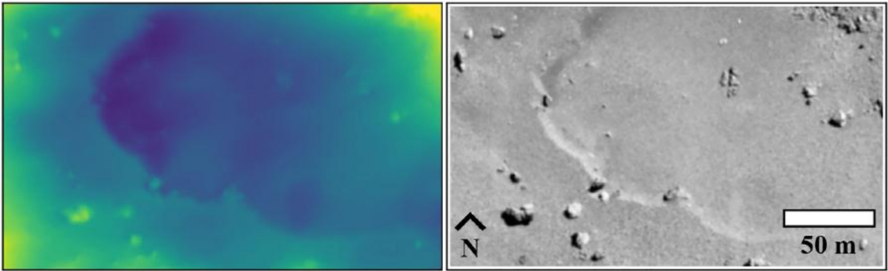

.. _sfs:

sfs
---

The ``sfs`` tool can add more detail to a DEM using shape-from-shading
(:cite:`alexandrov2018multiview`). The ``parallel_sfs`` program
(:numref:`parallel_sfs`) extends ``sfs`` to run using multiple
processes on multiple machines.

An overview and examples of using this program are in :numref:`sfs_usage`.

Illustration
~~~~~~~~~~~~

   Refining the surface of Comet 67P with shape-from-shading
   (:cite:`jindal2024measuring_v2`). Left: produced terrain. Right: input image.
   

Usage
~~~~~

::

     sfs -i <input DEM> -n <max iterations> -o <output prefix> \
       [other options] <images> <cameras>

The tool outputs at each iteration the current DEM and other auxiliary
and appropriately-named datasets, which are documented further down.

Example
~~~~~~~

::

     sfs --max-iterations 5 --use-approx-camera-models    \
       --crop-input-images --bundle-adjust-prefix ba/run  \
        -i input_dem.tif image1.cub image2.cub -o run/run

See many detailed worked-out examples in :numref:`sfs_usage`, including for the
Moon and Earth.

Inputs
~~~~~~

The SfS program takes as input a DEM to refine, images, cameras
(contained within the ``.cub`` image files for ISIS data), Sun positions
(normally embedded in the cameras), and (optionally but strongly
suggested) camera adjustments, which makes sure the images are
registered to each other and to the ground (the detailed examples in
:numref:`sfs_usage` discuss this).

.. _sfs_outputs:

Outputs
~~~~~~~

The ``sfs`` outputs are saved at the location given by the output prefix (option
``-o``).  If that is set to ``run/run`` as in the example above, the
outputs are:

 - ``run/run-DEM-final.tif`` - The refined SfS DEM.

 - ``run/run-exposures.txt`` - computed exposures for the images. These can be passed
   back to ``sfs`` via ``--image-exposures-prefix``.

 - ``run/run-haze.txt`` - computed haze values for the images. These can be passed
   back to ``sfs`` via ``--haze-prefix``. Only created if ``--num-haze-coeffs`` is
   positive.
   
 - ``run-albedo-estim.tif`` - The estimated initial albedo (if
   ``--float-albedo`` is on). It is produced by sampling the DEM with option
   ``--num-samples-for-estim``, then interpolated to all DEM pixels. Can be
   passed to ``sfs`` via ``--input-albedo``. Normally ``parallel_sfs`` takes
   care of the initial estimation and passing this along.

 - ``run/run-comp-albedo-final.tif`` - The computed albedo. All its values are 1
   unless the option ``--float-albedo`` is used. 

 - ``run/run-<image>-final-meas-intensity.tif`` - For each input image, this
   has the actual (measured) image values at each refined DEM grid point. 

 - ``run/run-<image>-final-comp-intensity.tif`` - For each input image,
   this has the simulated image values at each refined DEM grid point using
   the reflectance model and the Sun position for the
   current image. If the modeling is perfect, the measured input image
   will precisely agree with the simulated (modeled) image. In reality
   these are close but different.

 - ``run/run-<image>-final-meas-albedo.tif`` - This stores the measured
   input image divided by the exposure times computed reflectance. Hence
   this is more of an input quantity rather than the result of computing
   the albedo. That one is mentioned above.

In addition, SfS saves intermediate values of many of these quantities
at each iteration, unless the flag ``--save-sparingly`` is used. SfS
may also save the "haze" values if this is solved for (see the
appropriate options below and :numref:`sfs_formulation`).

Command-line options for sfs
~~~~~~~~~~~~~~~~~~~~~~~~~~~~

-i, --input-dem <filename>
    The input DEM to refine using SfS.

--image-list
    A file containing the list of images, when they are too many to
    specify on the command line. Use space or newline as
    separator. See also ``--camera-list``.

--camera-list
    A file containing the list of cameras, when they are too many to
    specify on the command line. If the images have embedded camera
    information, such as for ISIS, this file must be empty but must
    be specified if ``--image-list`` is specified.

-o, --output-prefix <string>
    Prefix for output filenames. 

-n, --max-iterations <integer (default: 10)>
    Set the maximum number of iterations. Normally 5-10 iterations is
    enough, even when convergence is not reached, as the solution
    usually improves quickly at first and only very fine refinements
    happen later.

--reflectance-type <integer (default: 1)>
    Reflectance types:
    0. Lambertian
    1. Lunar-Lambert
    2. Hapke
    3. Experimental extension of Lunar-Lambert
    4. Charon model (a variation of Lunar-Lambert).

--smoothness-weight <float (default: 0.04)>
    The weight given to the cost function term which consists of sums of squares
    of second-order derivatives. A larger value will result in a smoother
    solution with fewer artifacts. The range can be in 0.01 -- 10,000. A
    discussion of this term is in :cite:`lesage2021constraints`. See also
    ``--gradient-weight``.

--initial-dem-constraint-weight <float (default: 0)>
    A larger value will try harder to keep the SfS-optimized DEM
    closer to the initial guess DEM. A value between 0.0001 and
    0.001 may work, unless your initial DEM is very unreliable.

--albedo-constraint-weight <float (default: 0)>
    If floating the albedo, a larger value will try harder to keep the optimized
    albedo close to the initial albedo. See also: ``--input-albedo`` and 
    ``--albedo-robust-threshold``.

--albedo-robust-threshold <float (default: 0)>
    If floating the albedo and this threshold is positive, apply a Cauchy loss
    with this threshold to the product of the albedo difference and the albedo
    constraint weight.

--bundle-adjust-prefix <path>
    Use the camera adjustments obtained by previously running
    bundle_adjust with this output prefix.

--float-albedo
    Float the albedo for each pixel.  Will give incorrect results
    if only one image is present. The albedo is normalized, its
    nominal value is 1.

--float-exposure
    Float the exposure for each image. Will give incorrect results
    if only one image is present. It usually gives marginal results.

--shadow-threshold <arg>
    A shadow threshold to apply to all images. Must be positive. Areas that are
    in shadow in all images will result in a blurred version of the input DEM,
    influenced by the ``--smoothness-weight``.

--shadow-thresholds <arg>
    Optional shadow thresholds for the input images (a list of real
    values in quotes, one per image). See also ``--shadow-threshold``.
    
--custom-shadow-threshold-list <arg> 
    A list having one image and one shadow threshold per line. For the
    images specified there, override the shadow threshold supplied by
    other means with this value.

--robust-threshold <arg>
    If positive, set the threshold for the robust
    measured-to-simulated intensity difference (using the Cauchy
    loss). Any difference much larger than this will be penalized.
    A good value may be 5% to 25% of the average image value or the
    same fraction of the computed image exposure values.

--estimate-height-errors
    Estimate the SfS DEM height uncertainty (in meters) by finding the height
    perturbation at each grid point which will make at least one of the
    simulated images at that point change by more than twice the discrepancy
    between the unperturbed simulated image and the measured image. The SfS DEM
    must be provided via the -i option. The number of iterations, blending
    parameters (``--blending-dist``, etc.), and smoothness weight are ignored.
    Results are not computed at image pixels in shadow. This produces <output
    ``prefix>-height-error.tif``. No SfS DEM is computed. See also:
    ``--height-error-params``. This uncertainty may be somewhat optimistic
    (:cite:`jindal2024measuring_v2`).

--height-error-params <double integer (default: 5.0 100)>
    Specify the largest height deviation to examine (in meters), and
    how many samples to use from 0 to that height.

--model-shadows
    Model the fact that some points on the DEM are in the shadow
    (occluded from the Sun).

--sun-positions <string (default: "")>
    A file having on each line an image name and three values in double
    precision specifying the Sun position in meters in ECEF coordinates (origin
    is planet center). Use a space as separator. If not provided, these will be
    read from the camera file for ISIS and CSM models. See also
    ``--sun-angles``.

--sun-angles <string (default: "")>
    A file having on each line an image name and two values in double precision
    specifying the Sun azimuth and elevation in degrees, relative to the center
    point of the input DEM. Use a space as separator. The azimuth is measured
    clockwise from the North, and the elevation is measured from the horizon.
    The site https://www.suncalc.org/ can help find these values. This is an
    alternative to ``--sun-positions``. 
    
--save-dem-with-nodata
    Save a copy of the DEM while using a no-data value at a DEM
    grid point where all images show shadows. To be used if shadow
    thresholds are set.

--use-approx-camera-models
    Use approximate camera models for speed. Only with ISIS .cub
    cameras.

--crop-input-images
    Crop the images to a region that was computed to be large enough
    and keep them fully in memory, for speed. This is the default
    in the latest builds.

--blending-dist <integer (default: 0)>
    Give less weight to image pixels close to no-data or boundary
    values. Enabled only when crop-input-images is true, for
    performance reasons. Blend over this many pixels. See also
    ``--blending-power``, ``--min-blend-size`` and
    ``--allow-borderline-data``. See example in :numref:`sfs-lola`.

--blending-power <double (default: 2.0)>
    Raise the blending weights (they are no more to 1.0) to this
    power. A higher value will result in smoother (but more abrupt)
    blending as the weights decay faster close to 0.

--min-blend-size <integer (default: 0)>
    Do not apply blending in shadowed areas for which both the width and height
    are less than this. This avoids losing data around small holes, but the
    solution may become less smooth.

--estimate-exposure-haze-albedo
    Estimate the exposure for each image, the haze for each image (if
    ``--num-haze-coeffs`` is positive), and the global low-resolution albedo (if
    ``--float-albedo`` is on), then quit. This operation samples the input DEM
    based on ``--num-samples-for-estim``. The produced files are described in :numref:`sfs_outputs`.
    
--compute-exposures-only
    This older option is equivalent to ``--estimate-exposure-haze-albedo``.

--image-exposures-prefix <path>
    Use this prefix to optionally read initial exposures (filename
    is ``<path>-exposures.txt``).

--input-albedo <string (default: "")>
    The input albedo image, if known. Must have the same dimensions as the input
    DEM. Otherwise it is initialized to 1. Can be refined with ``--float-albedo``.
    
--save-computed-intensity-only
    Save the computed (simulated) image intensities for given DEM, images,
    cameras, and reflectance model, without refining the DEM. The measured
    intensities will be saved as well, for comparison. The image exposures will
    be computed along the way unless specified via ``--image-exposures-prefix``,
    and will be saved in either case to ``<output prefix>-exposures.txt``. Same
    for haze, if applicable.

--allow-borderline-data
    At the border of the region where there are no lit pixels in any
    images, do not let the blending weights decay to 0. This
    noticeably improves the level of detail. The
    ``sfs_blend`` (:numref:`sfs_blend`) tool may need to be
    used to further tune this region. See an
    illustration in :numref:`sfs_borderline`.

--low-light-threshold <float (default: -1.0)>
    A threshold for low-light pixels. If positive, pixels with intensity between
    this and the shadow threshold will be given less weight, if other images
    have higher intensity values at the same ground point. This helps fix seams.
    See usage in :numref:`sfs_seams`. See also ``--low-light-weight-power`` and
    ``--low-light-blur-sigma``.

--low-light-weight-power <float (default: 4.0)>
    With the option ``--low-light-threshold``, the weight of a low-light pixel
    is inversely proportional with the discrepancy between the simulated and
    observed pixel value, raised to this power.

--low-light-blur-sigma <float (default: 3.0)>
    With the option ``--low-light-threshold``, apply a Gaussian blur with this
    sigma to the low-light weight image, to make it continuous.
            
--model-coeffs-prefix <path>
    Use this prefix to optionally read model coefficients from a
    file (filename is ``<path>-model_coeffs.txt``).

--model-coeffs <string of space-separated numbers>
    Use the reflectance model coefficients specified as a list of numbers in
    quotes. For example:

    * Lunar-Lambertian: O, A, B, C, would be ``"1 -0.019 0.000242 -0.00000146"``
    * Hapke: omega, b, c, B0, h, would be  ``"0.68 0.17 0.62 0.52 0.52"``
    * Charon: A, f(alpha), would be ``"0.7 0.63"``

--crop-win <xoff yoff xsize ysize>
    Crop the input DEM to this region before continuing.

--init-dem-height <float (default: NaN)>
    Use this value for initial DEM heights (measured in meters, relative to the
    datum). An input DEM still needs to be provided for georeference
    information.

--nodata-value <float (default: nan)>
    Use this as the DEM no-data value, over-riding what is in the
    initial guess DEM.

--fix-dem
    Do not float the DEM at all.  Useful when floating the model params.

--float-reflectance-model
    Allow the coefficients of the reflectance model to float (not
    recommended).

--query
    Print some info, including DEM size and the solar azimuth and
    elevation for the images, and exit. Invoked from parallel_sfs.

-t, --session-type <string (default: "")>
    Select the stereo session type to use for processing. Usually
    the program can select this automatically by the file extension, 
    except for xml cameras. See :numref:`ps_options` for
    options.
 
--steepness-factor <double (default: 1)>
    Try to make the terrain steeper by this factor. This is not
    recommended in regular use.

--curvature-in-shadow <double (default: 0)>
     Attempt to make the curvature of the DEM (the Laplacian) at
     points in shadow in all images equal to this value, which should
     make the DEM curve down.

--curvature-in-shadow-weight <double (default: 0)>
     The weight to give to the curvature in shadow constraint.

--lit-curvature-dist <double (default: 0)>
    If using a curvature in shadow, start phasing it in this far from
    the shadow boundary in the lit region (in units of pixels).

--shadow-curvature-dist <double (default: 0)>
    If using a curvature in shadow, have it fully phased in this far
    from shadow boundary in the shadow region (in units of pixels).

--integrability-constraint-weight <float (default: 0.0)>
    Use the integrability constraint from Horn 1990 with this value
    of its weight (experimental).

--smoothness-weight-pq <float (default: 0.0)>
    Smoothness weight for p and q, when the integrability constraint
    is used. A larger value will result in a smoother solution
    (experimental).

--num-haze-coeffs <integer (default: 0)>
    Set this to 1 to model the problem as ``image = exposure * albedo *
    reflectance + haze``, where ``haze`` is a single value for each image
    (:numref:`sfs_formulation`).

--float-haze
    If specified, float the haze coefficients as part of the optimization (if
    ``--num-haze-coeffs`` is 1).

--haze-prefix <string (default: "")>
    Use this prefix to read initial haze values (filename is
    ``<haze prefix>-haze.txt``). The file format is the same as what the
    tool writes itself, when triggered by the earlier options. If haze is
    modeled, it will be initially set to 0 unless read from such a
    file, and will be floated or not depending on whether ``--float-haze``
    is on. The final haze values will be saved to ``<output
    prefix>-haze.txt``.

--num-samples-for-estim <integer (default: 200)>
    Number of samples to use for estimating the exposure, haze, and albedo. A large
    value will result in a more accurate estimate, but will take a lot more memory.
    
--read-exposures
    If set, read the image exposures with the current output prefix. Useful with
    a repeat invocation from ``parallel_sfs``, when with this option the
    exposures of the current tile are read, and not for the whole site. 

--read-haze
    If set, read the haze values with the current output prefix. See also
    ``--read-exposures``.

--read-albedo
    If set, read the computed albedo with the current output prefix. See also ``--read-exposures``.    
     
--gradient-weight <float (default: 0.0)>
    The weight given to the cost function term which consists of sums
    of squares of first-order derivatives. A larger value will result
    in shallower slopes but less noise. This can be used in conjunction with 
    ``--smoothness-weight``. It is suggested to experiment with this
    with a value of 0.0001 - 0.01, while reducing the
    smoothness weight to a very small value.

--save-sparingly
    Avoid saving any results except the adjustments and the DEM, as
    that's a lot of files.

--camera-position-step-size <integer (default: 1)>
    Larger step size will result in more aggressiveness in varying
    the camera position if it is being floated (which may result
    in a better solution or in divergence).

--threads <integer (default: 8)>
    How many threads each process should use. This will be changed to 
    1 for ISIS cameras when ``--use-approx-camera-models`` is not set,
    as ISIS is single-threaded. Not all parts of the computation
    benefit from parallelization.

--cache-size-mb <integer (default = 1024)>
    Set the system cache size, in MB.

--tile-size <integer (default: 256 256)>
    Image tile size used for multi-threaded processing.

--no-bigtiff
    Tell GDAL to not create BigTiff files.

--tif-compress <None|LZW|Deflate|Packbits (default: LZW)>
    TIFF compression method.

-v, --version
    Display the version of software.

-h, --help
    Display this help message.
