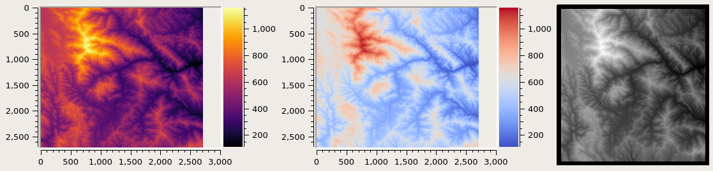
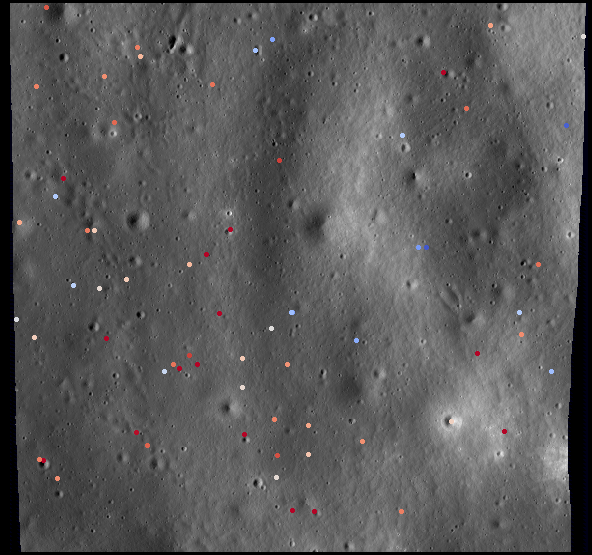
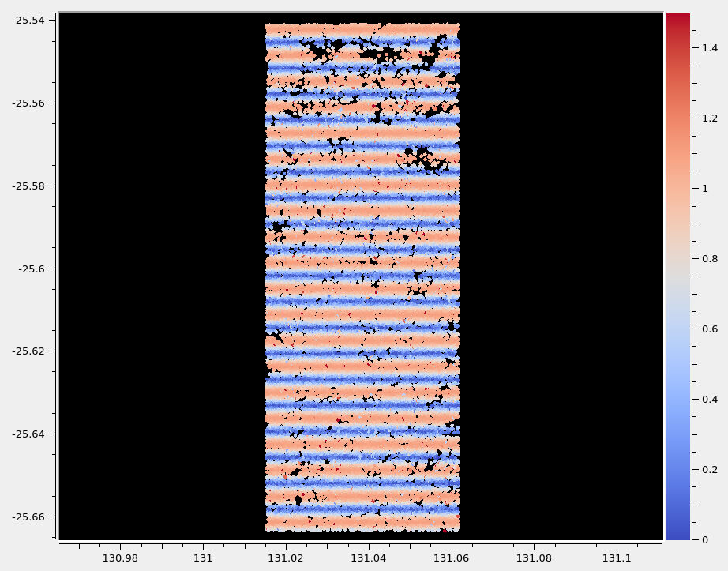
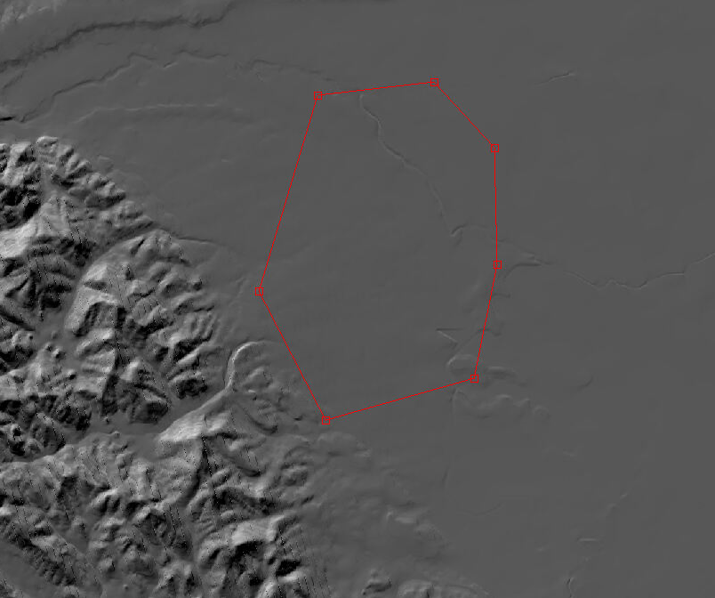
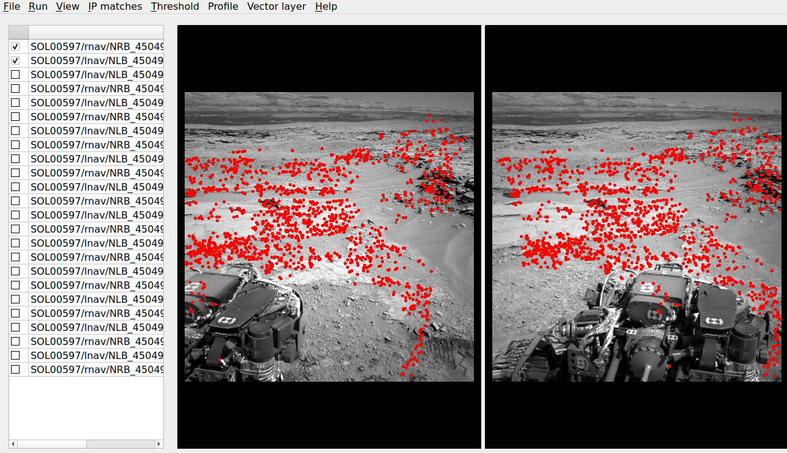

.. _stereo_gui:

stereo_gui
----------

The ``stereo_gui`` program is a GUI frontend to ``stereo`` and
``parallel_stereo`` (:numref:`parallel_stereo`). It can be used
for running stereo on small clips.

In addition, it can inspect the input images and produced datasets.

Use as stereo front-end
~~~~~~~~~~~~~~~~~~~~~~~

This program can be invoked just as ``parallel_stereo``::

    stereo_gui [options] <images> [<cameras>] output_file_prefix [dem]

Here is an example when using RPC cameras::
 
    stereo_gui -t rpc left.tif right.tif left.xml right.xml run/run

One can zoom with the mouse wheel, or by dragging the mouse from
upper-left to lower-right (zoom in), and vice-versa (zoom out), Use
the arrow keys to pan (first click to bring the image in focus).

By pressing the ``Control`` key while dragging the mouse, clips can be
selected in the input images, and then the stereo programs can be run
on these clips from the ``Run`` menu. The desired regions are passed
to these programs via the ``--left-image-crop-win`` and
``--right-image-crop-win`` options. The actual command being used will
be displayed on screen, and can be re-run on a more powerful
machine/cluster without GUI access.

If the images are map-projected (:numref:`mapproj-example`), the low-resolution
DEM will show up as the third image. There is no need to select a clip in that
DEM.

.. figure:: ../images/stereo_gui.jpg
   :name: asp_gui_fig
   :alt: stereo_gui

   An illustration of ``stereo_gui``. Stereo processing will happen on
   the regions selected by red rectangles.

If this program is invoked with two images (with or without cameras
and output prefix) and with values for ``--left-image-crop-win`` and
``--right-image-crop-win``, it will draw the corresponding regions on
startup.

See also our tutorials in :numref:`tutorial`.

Use as an image viewer
~~~~~~~~~~~~~~~~~~~~~~

This program can be also used as a general-purpose image viewer, case in
which no stereo options or cameras are necessary. It can
display arbitrarily large images with integer, floating-point, or RGB
pixels, including ISIS .cub files and DEMs. It handles large images by
building on disk pyramids of increasingly coarser subsampled images and
displaying the subsampled versions that are appropriate for the current
level of zoom.

The images can be shown either all side-by-side (default), several
side-by-side (``--view-several-side-by-side``), as tiles on a grid
(using ``--grid-cols integer``), or on top of each other (using
``--single-window``).

When the images are shown on top of each other, the option ``--use-georef`` will
overlay the images correctly if georeference information is present. In recent
builds this is the default, if all georeferences exist, and this mode can be
turned off with ``--no-georef``.

It is possible to switch among the various display modes from the ``View`` menu.

When the images are shown side-by-side, the GUI can zoom in all images to the
same region, for easier comparison among them. This is accessible from the
``View`` menu and with the option ``--zoom-all-to-same-region``.

When the images are in a single window, an individual image can be
turned on or off via a checkbox. Clicking on an image's name will zoom
to it and display it on top of other images. By right-clicking on an
image name, other operations can be performed, such as hillshading,
etc.

In this mode, the keys ``n`` and ``p`` can be used to cycle among
the images.

.. _stereo_gui_other:

Other features
~~~~~~~~~~~~~~

The ``stereo_gui`` program can:

  - Create and show hillshaded DEMs (:numref:`stereo_gui_hillshade`).
   
  - Colorize images on-the-fly and show them with a
    colorbar and axes (:numref:`colorize`).

  - Display the output of the ASP ``colormap`` and ``hillshade`` tools
    (:numref:`colormap`, :numref:`hillshade`).

  - Overlay scatter plots on top of images (:numref:`plot_csv`).

  - Overlay and edit polygons (:numref:`plot_poly`).

  - Find pixel values and region bounds (:numref:`image_bounds`).

  - View (:numref:`stereo_gui_view_ip`) and edit (:numref:`stereo_gui_edit_ip`)
    interest point matches displayed on top of images.

  - Load .nvm files having an SfM solution (:numref:`stereo_gui_nvm`).
   
  - View ISIS ``jigsaw`` control network files (:numref:`stereo_gui_isis_cnet`).

  - View GCP and .vwip files (:numref:`stereo_gui_vwip_gcp`).

  - Create GCP with georeferenced images and a DEM (:numref:`creatinggcp`).

  - Create interest point matches using mapprojected images (:numref:`mapip`).

  - Threshold images (:numref:`thresh`).
   
  - Cycle through images, showing one at a time (:numref:`gui_cycle`).

  - Save a screenshot to disk in the BMP or XPM format.

.. _stereo_gui_hillshade:

Hillshading
~~~~~~~~~~~

The ``stereo_gui`` program can create and display hillshaded DEMs. Example::

    stereo_gui --hillshade dem.tif

Or, after the DEM is open, select from the GUI View menu the ``Hillshaded
images`` option. 

Right-click to change the azimuth and elevation angles, hence the direction and
height of the light source. Then toggle hillshading off and then on again.

Hillshaded images can also be produced with the ``hillshade`` tool
(:numref:`hillshade`) or with ``gdaldem hillshade`` (:numref:`gdal_tools`).

Images that are both colorized and hillshaded can be created with ``colormap``
(:numref:`colormap`), and then loaded in this program.

.. _colorize:

Displaying colorized images, with a colorbar and axes
~~~~~~~~~~~~~~~~~~~~~~~~~~~~~~~~~~~~~~~~~~~~~~~~~~~~~

``stereo_gui`` can have images be colorized on-the-fly by mapping intensities to
colors of a given colormap. The results are plotted with a colorbar and axes
(with ticks). 

CSV files can be shown with a colorbar as well.

An example invocation is as follows::

    stereo_gui --colorbar              \
      --colormap-style inferno         \
      img1.tif                         \
      --colormap-style binary-red-blue \
      img2.tif                         \
      --no-colorbar                    \
      img3.tif

This will colorize the first image using the ``inferno`` colormap, the
second one with the ``binary-red-blue`` colormap, and will not
colorize the third one. See :numref:`colormap` for the full list of
colormaps. 

The ``--colorbar`` option applies to all subsequent images until
``--no-colorbar`` is encountered, and vice-versa. Each 
``--colormap-style`` option also applies to all subsequent images until
overridden by this option with another value.

The range of intensities of each colorized image is computed automatically.
Right-click in each image to adjust this range. The ``--min`` and ``--max``
options will set values for these that will apply to all images.

   An illustration of displaying images with specified colormap, with colorbar
   and axes, and without them. See :numref:`scattered_points_colorbar` for
   an example having scattered points.

.. _plot_csv:

View scattered points
~~~~~~~~~~~~~~~~~~~~~

``stereo_gui`` can plot and colorize scattered points stored in CSV files, and
overlay them on top of images or each other. Each point will show up as a dot
with a radius given by ``--plot-point-radius``. A colorbar and axes can be shown
as well (:numref:`scattered_points_colorbar`).

Here is an example of plotting the final ``*pointmap.csv``
residuals created by ``bundle_adjust`` for each interest point
(:numref:`ba_out_files`)::

    stereo_gui --colorize --colormap-style binary-red-blue \
      --min 0 --max 0.5 --plot-point-radius 2              \
      ba/run-final_residuals_pointmap.csv

This will use the longitude and latitude as the position, and will
determine a color based on the 4th field in this file (the error) and
the min and max values specified above (which correspond to blue
and red in the colorized plot, respectively). 

Files whose name contain the strings ``match_offsets`` and ``anchor_points``
(created by ``bundle_adjust`` and ``jitter_solve``, :numref:`jitter_solve`), and
error files created by ``pc_align`` (:numref:`pc_align_error`) can be plotted
the same way. Same with ``diff.csv`` files created by ``geodiff``
(:numref:`geodiff`), only in the latter case the third (rather than fourth)
column will have the intensity (error) value.

The option ``--colormap-style`` accepts the same values as
``colormap`` (:numref:`colormap`).

To plot an arbitrary CSV file with longitude, latitude and value, do::

    stereo_gui --csv-format "1:lon 2:lat 3:height_above_datum" \
      --datum D_MOON --colorize                                \
      filename.csv

If the file has data in projected units (such as using Easting and
Northing values), specify the option ``--csv-srs`` having the
projection, and use for the CSV format a string such as::

  "1:easting 2:northing 3:height_above_datum"

   A colorized CSV file overlaid on top of a georeferenced image.

   A colorized CSV file with a colorbar and axes. This uses the  ``--colorbar``
   option. For the moment, several datasets with colorbars can only be displayed
   side-by-side (:numref:`colorize`).

.. _plot_poly:

Polygon editing and contouring
~~~~~~~~~~~~~~~~~~~~~~~~~~~~~~

``stereo_gui`` can be used to draw and edit polygonal shapes on top of
georeferenced images, save them as shape files (``*.shp``) or in plain
text, and load such files from the command line (including ones
produced with external tools). The editing functionality can be
accessed by turning on polygon editing from the ``Vector layer`` menu,
and then right-clicking with the mouse to access the various
functions.

To create polygons, click with the left mouse button on points to be
added. When clicking close to the starting point, the polygon becomes
closed and and a new one can be drawn. A single point can be drawn by
clicking twice in the same location. To draw a segment, click on its
starting point, ending point, and then its starting point again.
*One must return to the starting point for the polygon to be recorded.*

The resulting shapes can be saved from the right-click menu as shapefiles or in
plain text. The shapefile specification prohibits having a mix of points,
segments, and polygons in the same file, so all drawn shapes must be of the same
kind.

When reading polygons and georeferenced images from disk, choose "View
as georeferenced images" to plot the polygons on top of the images.

A polygon drawn on top of a georeferenced image, in the "move vertices" editing
mode.

Plain-text polygon files
^^^^^^^^^^^^^^^^^^^^^^^^

The ``stereo_gui`` program can overlay plain-text polygon files on top of
images, such as::

    stereo_gui --use-georef --single-window poly1.txt poly2.txt image.tif

if each of these has georeference (and csv format) information. That is the
case when the polygons were created in the GUI and saved to disk. 
This polygon format is described in :numref:`poly_files`.

To display polygons from any text file, additional options should be specified,
such as::

  stereo_gui --style poly --csv-format 1:lon,2:lat \
    --csv-datum D_MOON poly.csv

If such a file has multiple columns, the indices above can be changed
to the ones desired to plot. Files having Easting-Northing information
can be loaded as in :numref:`plot_csv`, while omitting the third
column in the csv format string.

If no georeference information exists, the CSV format can be 
set to ``1:x,2:y`` if it is desired to have the y axis point up, and 
``1:pix_x,2:pix_y`` if it should point down, so that such polygons
can be overlaid on top of images.

Any polygon properties set in the files will override the ones specified on the
command line, to ensure that files with different properties can be loaded
together.

.. _gdal_rasterize_example:

Application
^^^^^^^^^^^

As an application of drawing a polygon with ``stereo_gui``, the
``gdal_rasterize`` command can be used to keep or exclude the portion of a given
georeferenced image or a DEM that is within or outside the polygonal shape.
Example::

  gdal_rasterize -i -burn <nodata_value> poly.shp dem.tif

Here, if the DEM nodata value is specified, the DEM will be edited and
values outside the polygon will be replaced with no data.

This tool can be used to find the polygonal contour at a given image
threshold (which can be either set or computed from the ``Threshold``
menu). This option is accessible from the ``Vector layer`` menu as well,
with or without the polygon editing mode being on.

.. _image_bounds:

Finding pixel values and region bounds
~~~~~~~~~~~~~~~~~~~~~~~~~~~~~~~~~~~~~~

When clicking on a pixel of an image opened in ``stereo_gui``, the
pixel indices and image value at that pixel will be printed on screen.

When selecting a region by pressing the ``Control`` key while dragging
the mouse, the region pixel bounds (``src win``) will be displayed on
screen. If the image is geo-referenced, the extent of the region in
projected coordinates (``proj win``) and in the longitude-latitude
domain (``lonlat win``) will be shown as well.

The pixel bounds can be used to crop the image with ``gdal_translate
-srcwin`` (:numref:`gdal_tools`) and with the ISIS ``crop``
command. The extent in projected coordinates can be used to crop
with ``gdal_translate -projwin``, and is also accepted by
``gdalwarp``, ``point2dem``, ``dem_mosaic``, and ``mapproject``,
for use with operations on regions.

One can zoom to a desired proj win from the ``View`` menu. This is helpful
to reproduce a zoom level. If multiple images are present,
the proj win used is for the first one. This can be invoked at startup
via ``--zoom-proj-win``.

.. _stereo_gui_view_ip:

View interest point matches
~~~~~~~~~~~~~~~~~~~~~~~~~~~

``stereo_gui`` can be used to view interest point matches (``*.match``
files), such as generated by ``ipmatch`` (:numref:`ipmatch`),
``bundle_adjust`` (:numref:`bundle_adjust`), or
``parallel_stereo``. Several modes are supported.

View matches for an image pair
^^^^^^^^^^^^^^^^^^^^^^^^^^^^^^

The match file to load can be specified via ``--match-file``, or loaded
based on extension, if running::

    stereo_gui left.tif right.tif run/run-left__right.match

It may also be auto-detected if ``stereo_gui`` was invoked like ``parallel_stereo``,
with an output prefix::

   stereo_gui left.tif right.tif run/run

and then the match file is loaded from the *IP matches -> View IP matches*
menu. (Auto-detection works only when the images are not
mapprojected, stereo was not run on image clips, and alignment method
is not ``epipolar`` or ``none``.)

See also editing of interest point matches in
:numref:`stereo_gui_edit_ip`.

.. _stereo_gui_pairwise_matches:

View pairwise matches for *N* images
^^^^^^^^^^^^^^^^^^^^^^^^^^^^^^^^^^^^

Given *N* images and interest point matches among any of them, such as
created by ``bundle_adjust``, the options ``--pairwise-matches`` and
``--pairwise-clean-matches`` (:numref:`gui_options`), also accessible
from the *IP matches* menu, can load the match file for a selected
image pair if the output prefix was specified. For that, run::

   stereo_gui --pairwise-matches image1.tif ... imageN.tif run/run

then select a couple of images to view using the checkboxes on the
left, and their match file will be displayed automatically. 

This mode is available also from the *View* menu.

See an illustration in :numref:`asp_gui_nvm`.

.. _stereo_gui_N_image_matches:

View all matches for *N* images
^^^^^^^^^^^^^^^^^^^^^^^^^^^^^^^

This mode allows viewing (and editing, see
:numref:`stereo_gui_edit_ip`), interest points for *N* images at once,
but some rigid and a bit awkward conventions are used, to be able to
display all those points at the same time.

For image i, the match file must contain the matches from image i-1 to
i, or from image 0 to i. You can provide these match files to
``stereo_gui`` by conforming to its naming convention
(``output-prefix-fname1__fname2.match``) or by selecting them from the
GUI when prompted. All match files must describe the same set of
interest points. The tool will check the positions of loaded points
and discard any that do not correspond to the already loaded points.

Run::

    stereo_gui image1.tif ... imageN.tif run/run

(the last string is the output prefix). Select viewing of interest
point matches. 

If one of the match files fails to load or does not contain
enough match points, the missing points will be added to an
arbitrary position and flagged as invalid. You must either validate
these points by manually moving them to the correct position or else
delete them.

.. _stereo_gui_nvm:

View NVM files
^^^^^^^^^^^^^^

This tool can also visualize pairwise interest point matches loaded
from a plain-text .nvm file created by a Structure-from-Motion tool, such as
``theia_sfm`` (:numref:`theia_sfm`) and ``rig_calibrator``
(:numref:`rig_calibrator`).

This file normally has all features shifted relative to the camera optical
center. Then an associated ``_offsets.txt`` file must exist having the optical
center per image. The above-mentioned programs write such an offset file. This
file is auto-loaded along with the .nvm file.

An .nvm file having features that are not shifted can be loaded as
well. Such files are created by ``rig_calibrator`` with the
``--save_nvm_no_shift`` option (:numref:`rig_calibrator`). 
In this case, call ``stereo_gui`` with the additional option
``--nvm-no-shift``.

Example::

    stereo_gui --nvm-no-shift --nvm nvm_no_shift.nvm

(The ``--nvm`` option can also be omitted, and only the file itself
can be specified.)

In this mode, the lowest-resolution subimage size is larger than
usual, to avoid creating small files.  See
``--lowest-resolution-subimage-num-pixels``.

   An illustration of ``stereo_gui`` displaying an .nvm file. 
   Pairs of images can be chosen on the left, and matches will be shown.
   The images were created with the MSL Curiosity rover (:numref:`rig_msl`).

.. _stereo_gui_isis_cnet:

View ISIS control network files
^^^^^^^^^^^^^^^^^^^^^^^^^^^^^^^

The ISIS jigsaw (:numref:`jigsaw`) binary control network format can be
visualized as::

  stereo_gui <image files> --isis-cnet <cnet file>

This file is expected to end with ``.net``. The images must be the same as in the
control network, and in the same order, or else the results will be incorrect.
This file format does not keep track of the image names.

ASP's ``bundle_adjust`` can also create and update such files
(:numref:`control_network`). Then, non-ISIS images can be used as well, and this
tool can load the resulting control network. 

.. _stereo_gui_vwip_gcp:

View GCP and .vwip files
~~~~~~~~~~~~~~~~~~~~~~~~

This tool can show the interest points from a GCP file (:numref:`bagcp`).
Example::

    stereo_gui image1.tif ... imageN.tif --gcp-file mygcp.gcp

This works even for a single image. If ``--gcp-file`` is not specified
but the GCP file is provided, this file will still be loaded.

Creating GCP is described in :numref:`creatinggcp`. 

The ``stereo_gui`` program can also display ``.vwip`` files. Those are
interest points created by ``ipfind``, ``bundle_adjust``, or
``parallel_stereo``, before they are matched across images. One should
specify as many such files as images when launching this program.

.. _stereo_gui_edit_ip:

Edit interest point matches
~~~~~~~~~~~~~~~~~~~~~~~~~~~

``stereo_gui`` can be used to manually create and delete interest
point matches (useful in situations when automatic interest point
matching is unreliable due to large changes in illumination). This
works for *N* images.

Example::

    stereo_gui image1.tif ... imageN.tif run/run

(the last string is the output prefix).

Select from the top menu::

    IP matches -> View IP matches

If some matches exist already, they will be loaded, per
:numref:`stereo_gui_N_image_matches`. Do not use
``--pairwise-matches`` and ``--pairwise-clean-matches`` here.

Interest point matches can be created or deleted with the right-mouse
click. This works whether a pre-existing match file was loaded, or
starting from scratch.

To move interest points, right-click on an image and check "Move match
point". While this is checked, one can move interest points by clicking
and dragging them within the image extent.  Uncheck "Move match point" to
stop moving interest points.

The edited interest point matches can be saved from the *IP matches* menu.
:numref:`ba_match_files` describes the naming convention (both for
``bundle_adjust`` and ``parallel_stereo``). Then these programs will be able to
pick up the produced matches.

If handling *N* images at once becomes too complicated, it is suggested
to edit the matches one pair at a time.

.. _creatinggcp:

Creating GCP with with an orthoimage and a DEM
~~~~~~~~~~~~~~~~~~~~~~~~~~~~~~~~~~~~~~~~~~~~~~

There exist situations when one has one or more images for which the camera
files are either inaccurate or, for Pinhole camera models, just the intrinsics
may be known. 

Given a DEM of the area of interest, and optionally an orthoimage (mapprojected
image, georeferenced image), these an be used to create GCP files
(:numref:`bagcp`). GCP can be provided to ``bundle_adjust`` to refine the camera
poses, transform the cameras to given coordinates, or to create new
cameras (:numref:`ba_use_gcp`).

A DEM can be obtained using the instructions in :numref:`initial_terrain`.
Use, if applicable, ``dem_geoid`` to convert the DEM to be relative
to an ellipsoid.

Open the desired images, the orthoimage, the DEM, and the GCP file to
be created in the GUI, as follows::

    stereo_gui img1.tif img2.tif img3.tif \
      ortho.tif                           \
      --dem-file dem.tif                  \
      --gcp-file output.gcp               \
      --gcp-sigma 1.0                     \
      run/run

The orthoimage must be after the images for which GCP will be
created. If no orthoimage exists, one can use the given DEM
instead (and it can be hillshaded after loading to easier identify
features).

The ground locations are found from the orthoimage and their elevations from the
DEM. The interest points in the orthoimage are not saved to the GCP file.

A feature is identified and manually added as a matching interest point (match
point) in all open images, from left to right. For that, use the right
right-click menu, and select ``Add match point``. This process is repeated a few
times. If the match point is not added in all images before starting with a new
one, that will result in an error.  The match points can be moved around by
right-clicking to turn on this mode, and then dragging them with the mouse.

When done creating interest points, use the ``IP matches -> Write GCP file``
menu item to save the GCP file. It is suggested to save the interest point
matches from the same menu, as later those can be edited and reused to create
GCP, while GCP cannot be edited.

If above the reference DEM and GCP file were not set, the GUI
will prompt for their names.

If having many images, this process can be repeated for several small sets,
creating several GCP files that can then be passed together to ``bundle_adjust``.

The sigmas for the GCP should be set via the option ``--gcp-sigma``. Or use
``bundle_adjust`` with the option ``--fix-gcp-xyz`` to ensure GCP are kept
fixed during optimization.
 
GCP can be visualized in ``stereo_gui`` (:numref:`stereo_gui_vwip_gcp`).

If the input images and the orthoimage are very similar visually, one can 
try to automatically detect and load interest point matches as follows::

    ipfind img.tif ortho.tif
    ipmatch img.tif ortho.tif
    stereo_gui img.tif ortho.tif    \
      --match-file img__ortho.match \
      --dem-file dem.tif            \
      --gcp-file output.gcp         \
      --gcp-sigma 1.0

Then, the interest points can be inspected and edited as needed, and the GCP
file can be saved as above. See the documentation of ``ipfind``
(:numref:`ipfind`) and ``ipmatch`` (:numref:`ipmatch`), for how to increase the
number of matches, etc.

Lastly, non-GUI automatic approaches exists as well. Two methods are supported:
tying a raw image to an orthoimage and a DEM (:numref:`gcp_gen`), and tying a
produced DEM to a prior DEM (:numref:`dem2gcp`).

See earlier in this section for how GCP can be used.

.. _mapip:

Creating interest point matches using mapprojected images
~~~~~~~~~~~~~~~~~~~~~~~~~~~~~~~~~~~~~~~~~~~~~~~~~~~~~~~~~

To make it easier to create interest point matches in situations when the images
are very different or taken from very diverse perspectives, the images can be
first mapprojected onto a DEM, as then they look a lot more similar. The
interest points are created among the mapprojected images, and the matches are
transferred to the original images.

This section will describe how to do this with automatic and manual (GUI) means.

Given three images ``A.tif``, ``B.tif``, and ``C.tif``,
cameras ``A.tsai``, ``B.tsai``, and ``C.tsai``, and a DEM named ``dem.tif``,
mapproject the images onto this DEM (:numref:`mapproject`), obtaining the images
``A.map.tif``, ``B.map.tif``, and ``C.map.tif``.

::

    for f in A B C; do
        mapproject --tr 1.0 dem.tif $f.tif $f.tsai $f.map.tif
    done

The same resolution (option ``--tr``) should be used for all images, which should
be a compromise between the ground sample distance values for these images.

See :numref:`mapproj-example` how how to find a DEM for mapprojection and other
details.

Bundle adjustment will find interest point matches among the mapprojected images,
and transfer them to the original images. Run::

    bundle_adjust A.tif B.tif C.tif A.tsai B.tsai C.tsai          \
      --mapprojected-data 'A.map.tif B.map.tif C.map.tif dem.tif' \
      --min-matches 0 -o run/run 

This will not recreate any existing match files either for
mapprojected images or for unprojected ones. If that is
desired, existing match files need to be deleted first.

Add options such as ``--ip-per-tile 250 --matches-per-tile 250`` if needed to
increase the number of interest point matches.

If these images become too many to set on the command line, use the 
options ``--image-list``, ``--camera-list``, ``--mapprojected-data-list``
(:numref:`ba_options`).

The DEM at the end of this option is optional in the latest builds, 
if it can be looked up from the geoheader of the mapprojected images.

Each mapprojected image stores in its metadata the name of the original
image, the camera model, the bundle-adjust prefix, if any, and the DEM it
was mapprojected onto. Hence, the above command will succeed even if invoked
with different cameras than the ones used for mapprojection, as long as the 
original cameras are still present and did not change. 

If the mapprojected images are still too different for interest point
matching among them to succeed, one can try to bring in more images that
are intermediate in appearance or illumination between the existing
ones, so bridging the gap. 

Alternatively, interest point matching can be done *manually* in the GUI as
follows::

     stereo_gui --view-matches A.map.tif B.map.tif C.map.tif run/run

Interest points can be picked by right-clicking on the same feature in each
image, from left to right, and selecting ``Add match point``. Repeat this
process for a different feature. The matches can be saved to disk from the menu.

The bundle adjustment command from above can be invoked to unproject the
matches. Do not forget to first delete first the match files among unprojected
images so that ``bundle_adjust`` can recreate them based on the projected
images.

Run::

     stereo_gui --view-matches A.tif B.tif C.tif run/run
     
to check if the interest point matches, that were created using mapprojected
images, were correctly transferred to the original images. Consider using instead
the option ``--pairwise-matches`` if some features are not seen in all images.

See :numref:`sfs3` for an illustration of this process.

It is suggested to use ``--mapprojected-data`` with ``--auto-overlap-params.`` 
Then, the interest point matching will be restricted to the region of overlap
(expanded by the percentage in the latter option).
    
.. figure:: ../images/sfs3.jpg
   :name: sfs3
   :alt: interest points picked manually

   An illustration of how interest points are picked manually for the
   purpose of bundle adjustment. This is normally not necessary
   if there exist images with intermediate illumination.

.. _thresh:

Image threshold
~~~~~~~~~~~~~~~

``stereo_gui`` can be used to compute an image threshold for each of a
given set of images based on sampling pixels (useful for
shape-from-shading, see :numref:`sfs_usage`). This can be done by turning on
from the menu the ``Threshold detection`` mode, and then
clicking on pixels in the image. The largest of the chosen pixel
values will be set to the threshold for each image and printed
to the screen.  

From the same menu it is possible to see or change the current threshold.

To highlight in the images the pixels at or below the image threshold,
select from the menu the ``View thresholded images`` option. Those
pixels will show up in red.

Related to this, if the viewer is invoked with ``--nodata-value
<double>``, it will display pixels with values less than or equal to
this as transparent, and will set the image threshold to that no-data
value.

.. _gui_cycle:

Cycle through images
~~~~~~~~~~~~~~~~~~~~

To load only one image at a time, for speed, specify all images on the command
line, together with the ``--preview`` option. Then, can cycle through them with
the 'n' and 'p' keys.

In this mode, the lowest-resolution subimage size is larger than usual to avoid
creating small images when building an image pyramid. See
``--lowest-resolution-subimage-num-pixels``.

.. _gui_options:

Command line options for ``stereo_gui``
~~~~~~~~~~~~~~~~~~~~~~~~~~~~~~~~~~~~~~~

Listed below are the options specific to ``stereo_gui``. It will
accept all other ``parallel_stereo`` options as well.

--grid-cols <integer (default: 1)>
    Display images as tiles on a grid with this many columns.

--window-size <integer integer (default: 1200 800)>
    The width and height of the GUI window in pixels.

-w, --single-window
    Show all images in the same window (with a dialog to choose
    among them) rather than next to each other.

--preview
    Load and display the images one at a time, for speed. The 'n' and
    'p' keys can be used to cycle through them.

--view-several-side-by-side
    View several images side-by-side, with a dialog to choose which
    images to show (also accessible from the View menu).

--use-georef
    Plot the images in the projected coordinate system given by
    the image georeferences. This is currently the default, and 
    can be turned off with ``--no-georef`` or from the View menu.

--nodata-value <double (default: NaN)>
    Pixels with values less than or equal to this number are treated
    as no-data and displayed as transparent. This overrides the
    no-data values from input images.

--hillshade
    Interpret the input images as DEMs and hillshade them.

--hillshade-azimuth
    The azimuth value when showing hillshaded images.

--hillshade-elevation
    The elevation value when showing hillshaded images.

--view-matches
    Locate and display the interest point matches for a stereo pair.
    See also ``--view-pairwise-matches``,
    ``--view-pairwise-clean-matches``.

--match-file
    Display this match file instead of looking one up based on
    existing conventions (implies ``--view-matches``).

--pairwise-matches
    Show images side-by-side. If just two of them are selected,
    load their corresponding match file, determined by the
    output prefix. Also accessible from the menu.

--pairwise-clean-matches
    Same as ``--pairwise-matches``, but use ``*-clean.match`` files.

--nvm <string (default="")>
    Load this .nvm file having interest point matches. See also
    ``--nvm-no-shift``. The ``rig_calibrator`` program
    (:numref:`rig_calibrator`) can create such files. This option implies
    ``--pairwise-matches``.

--nvm-no-shift
    Assume that the image features in the input nvm file were saved without
    being shifted to be relative to the optical center of the camera.
    
--isis-cnet <string (default="")>
    Load a control network having interest point matches from this binary file
    in the ISIS jigsaw format. See also ``--nvm``.
        
--gcp-file
    Display the GCP pixel coordinates for this GCP file (implies
    ``--view-matches``).  Also save here GCP if created from the
    GUI. See also ``--gcp-sigma``.

--gcp-sigma <double (default: 1.0)>
    The sigma (uncertainty, in meters) to use for the GCPs (:numref:`bagcp`). A
    smaller sigma suggests a more accurate GCP. See also option
    ``--fix-gcp-xyz`` in ``bundle_adjust`` (:numref:`ba_options`).

--dem-file
    Use this DEM when creating GCP from images.

--hide-all
    Start with all images turned off (if all images are in the same
    window, useful with a large number of images).

--zoom-proj-win <double double double double>
    Zoom to this proj win on startup (:numref:`image_bounds`). It is
    assumed that the images are georeferenced. Also accessible from
    the *View* menu.  This implies ``--zoom-all-to-same-region``.

--zoom-all-to-same-region
    Zoom all images to the same region. Also accessible from the *View* menu.

--colorize
    Colorize input CSV files (must set ``--min`` and ``--max``).

--colorbar
    Colorize all images and/or csv files after this option until the
    ``--no-colorbar`` option is encountered. Show these images with a colorbar
    and axes (:numref:`colorize`). Right-click in each image to adjust the
    range of intensities to colorize.

--no-colorbar
    Do not colorize any images after this option, until the option 
    ``--colorbar`` is encountered. 

--colormap-style <string (default="binary-red-blue")>
    Specify the colormap style. See :numref:`colormap` for options.
    Each style applies to all images after this option, until
    overridden by another instance of this option with a different
    value.

--min <double (default = NaN)>
    Value corresponding to 'coldest' color in the color map, when
    using the ``--colorize`` option and plotting csv data.
    Also used to manually set the minimum value in grayscale
    images. If not set, use the dataset minimum for
    color images, and estimate the minimum for grayscale images.

--max <double (default = NaN)>
    Value corresponding to the 'hottest' color in the color map, when
    using the ``--colorize`` option and plotting csv data.
    Also used to manually set the maximum value in grayscale
    images. If not set, use the dataset maximum for color images, and
    estimate the maximum for grayscale images.

--plot-point-radius <integer (default = 2)>
    When plotting points from CSV files, let each point be drawn as a
    filled ball with this radius, in pixels.

--csv-format <string>
    Specify the format of input CSV files as a list of entries
    column_index:column_type (indices start from 1).  Examples:
    ``1:x 2:y 3:z`` (a Cartesian coordinate system with origin at
    planet center is assumed, with the units being in meters),
    ``5:lon 6:lat 7:radius_m`` (longitude and latitude are in degrees,
    the radius is measured in meters from planet center),
    ``3:lat 2:lon 1:height_above_datum``,
    ``1:easting 2:northing 3:height_above_datum``
    (need to set ``--csv-srs``; the height above datum is in
    meters). Can also use radius_km for column_type, when it is
    again measured from planet center.

--csv-datum <string (default="")>
    The datum to use to to use when plotting a CSV file. Options:
    D_MOON (1,737,400 meters), D_MARS (3,396,190 meters), MOLA
    (3,396,000 meters), NAD83, WGS72, and NAD27. Also accepted: Earth
    (=WGS_1984), Mars (=D_MARS), Moon (=D_MOON).

--csv-srs <string (default="")>
    The PROJ or WKT string to use when plotting a CSV
    file. If not specified, try to use the ``--datum`` option. 

--lowest-resolution-subimage-num-pixels <integer (default: -1)>
    When building a pyramid of lower-resolution versions of an image,
    the coarsest image will have no more than this many pixels. If not
    set, it will internally default to 1000 x 1000. This is
    increased to 10000 x 10000 when loading .nvm files or with the
    ``--preview`` option to avoid creating many small files.

--font-size <integer (default = 9)>
    Set the font size.

--no-georef
    Do not use the georeference information when displaying the data,
    even when it exists. Also controllable from the View menu.

--delete-temporary-files-on-exit
    Delete any subsampled and other files created by the GUI when
    exiting.

--create-image-pyramids-only
    Without starting the GUI, build multi-resolution pyramids for
    the inputs, to be able to load them fast later. If used with
    ``--hillshade``, also build the hillshaded images and their
    multi-resolution pyramids.

--threads <integer (default: 0)>
    Select the number of threads to use for each process. If 0, use
    the value in ~/.vwrc.
 
--cache-size-mb <integer (default = 1024)>
    Set the system cache size, in MB.

--tile-size <integer (default: 256 256)>
    Image tile size used for multi-threaded processing.

--no-bigtiff
    Tell GDAL to not create BigTiff files.

--tif-compress <string (default = "LZW")>
    TIFF compression method. Options: None, LZW, Deflate, Packbits.

-v, --version
    Display the version of software.

-h, --help
    Display this help message.
