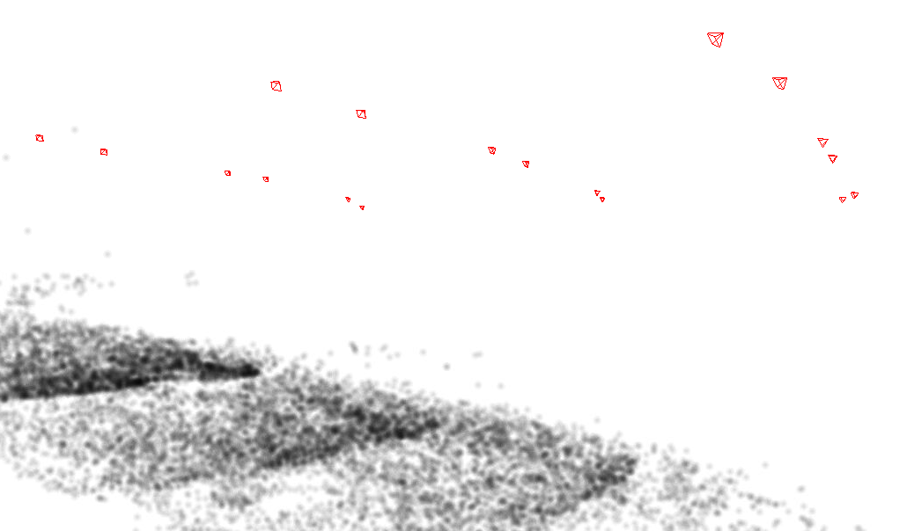

.. _view_reconstruction:

view_reconstruction
-------------------

This viewer is part of the Theia SfM suite of tools that ASP ships
(:numref:`theia_sfm`). It can show a 3D point cloud and the camera poses. See
``sfm_view`` (:numref:`sfm_view`) for a program that can show orbital cameras
(with no 3D points).

Example::

    view_reconstruction --reconstruction theia/reconstruction-0 

   
   Illustration of ``view_reconstruction``.

