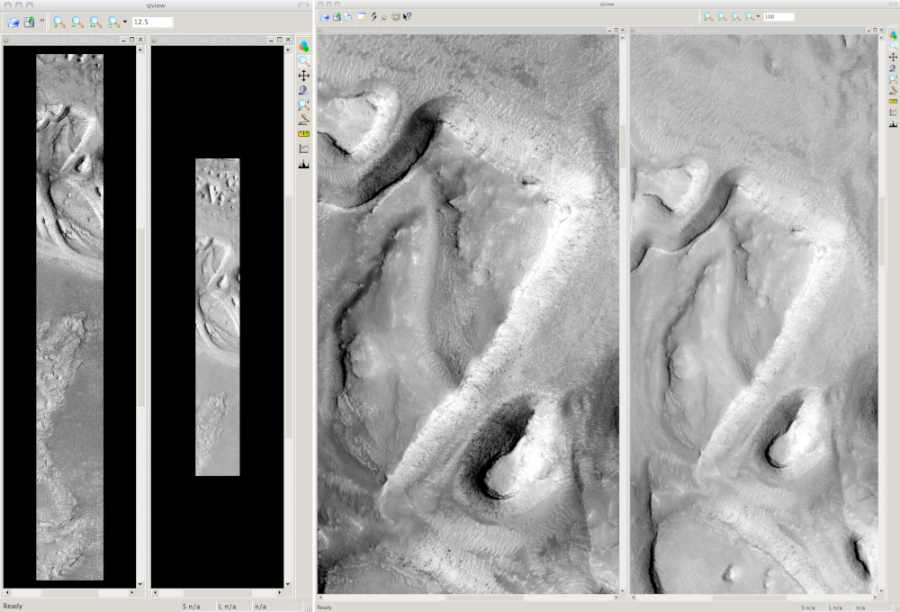
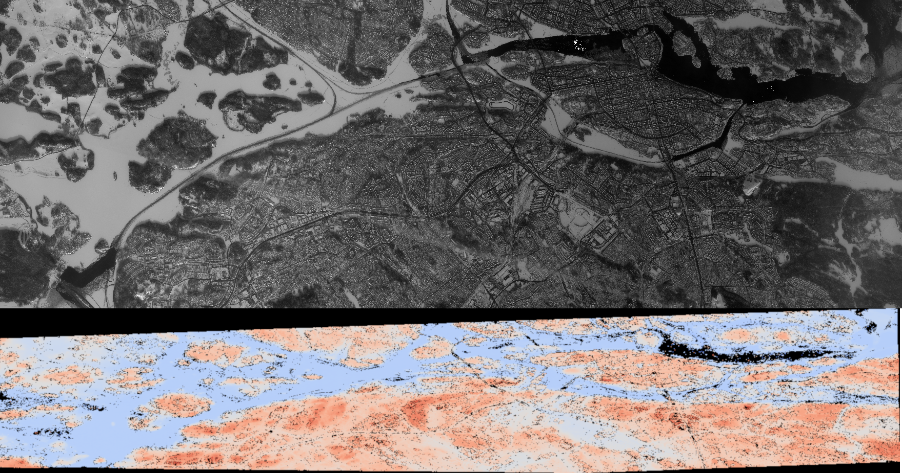
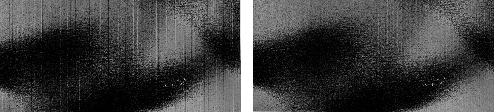
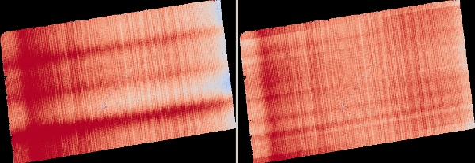
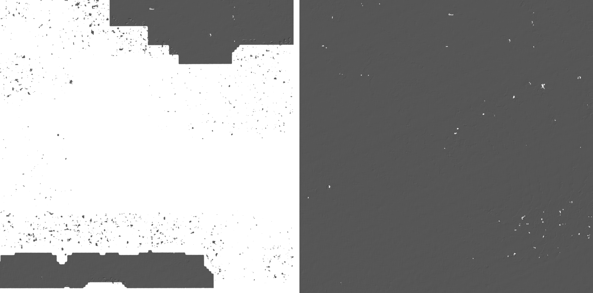

.. _moc_tutorial:

Tutorial: Processing Mars Orbiter Camera Images
================================================

Quick Start
-----------

The Stereo Pipeline package contains GUI and command-line programs that
convert a stereo pair in the ISIS ``.cub`` format into a 3D "point
cloud" image (its format is described in :numref:`outputfiles`). This is an
intermediate format that can be passed along to one of several programs
that convert a point cloud into a mesh for 3D viewing, a gridded digital
terrain model (DTM) for GIS purposes, or a LAS/LAZ point cloud.

There are a number of ways to fine-tune parameters and analyze the
results, but ultimately this software suite takes images and builds
models in a mostly automatic way. To create a point cloud file, you
simply pass two image files to the ``stereo`` command::

    ISIS> stereo left_input_image.cub right_input_image.cub stereo-output

Alternatively, the ``stereo_gui`` frontend can be invoked, with the
same options, as described in :numref:`stereo_gui`.
This tool makes it possible to select smaller clips or cropped
images on which to run ``stereo``.

The string ``stereo-output`` is an arbitrary output prefix, it is used
when generating names for ``stereo`` output files. For example, it can
be set to ``results/output``, in which case all output files will be in
the ``results`` directory and start with the prefix ``output``. See
:numref:`running-stereo` for a more detailed discussion.

You can then make a visualizable mesh or a DTM file with the following
commands (the ``stereo-output-PC.tif`` and ``stereo-output-L.tif`` files
are created by the ``stereo`` program above)::

     ISIS> point2mesh stereo-output-PC.tif stereo-output-L.tif
     ISIS> point2dem  stereo-output-PC.tif

More details are provided in :numref:`visualising`.

Preparing the Data
------------------

The data set that is used in the tutorial and examples below is a pair
of Mars Orbital Camera (MOC)
:cite:`1992JGR.97.7699M,2001JGR.10623429M` images
whose PDS Product IDs are M01/00115 and E02/01461. This data can be
downloaded from the PDS directly, or they can be found in the
``examples/MOC`` directory of your Stereo Pipeline distribution.

Loading and Calibrating Images using ISIS
~~~~~~~~~~~~~~~~~~~~~~~~~~~~~~~~~~~~~~~~~

These raw PDS images (``M0100115.imq`` and ``E0201461.imq``) need to be
imported into the ISIS environment and radiometrically calibrated. You
will need to be in an ISIS environment (usually via a ``conda activate``
command which sets the ``ISISROOT`` and ``ISISDATA`` environment variables; 
we will denote this state with the ``ISIS>`` prompt). Then you can use 
the ``mocproc`` program, as follows::

     ISIS> mocproc from=M0100115.imq to=M0100115.cub Mapping=NO
     ISIS> mocproc from=E0201461.imq to=E0201461.cub Mapping=NO

There are also ``Ingestion`` and ``Calibration`` parameters whose
defaults are ``YES`` which will bring the image into the ISIS format
and perform radiometric calibration. By setting the ``Mapping``
parameter to ``NO``, the resultant file will be an ISIS cube file
that is calibrated, but not map-projected. Note that while we have
not explicitly run ``spiceinit``, the Ingestion portion of ``mocproc``
quietly ran ``spiceinit`` for you (you'll find the record of it in
the ISIS Session Log, usually written out to a file named ``print.prt``).
:numref:`p19-images` shows the results at this stage of processing.

.. _p19-images:

   This figure shows ``E0201461.cub`` and
   ``M0100115.cub`` open in ISIS’s qview program. The view on the left
   shows their full extents at the same zoom level, showing how they have
   different ground scales. The view on the right shows both images zoomed
   in on the same feature.

Datasets for other type of cameras or other planets can be pre-processed
similarly, using the ISIS tools specific to them.

.. _aligning-images:

Aligning Images
~~~~~~~~~~~~~~~

Once the ``.cub`` files are obtained, it is possible to run stereo right
away::

     ISIS> stereo E0201461.cub M0100115.cub    \
               --alignment-method affineepipolar \
               -s stereo.default.example results/output

In this case, the first thing ``stereo`` does is to internally align (or
rectify) the images, which helps with finding stereo matches. Here we
have used ``affineepipolar`` alignment. Another option is to use
``homography`` alignment, as described in :numref:`settingoptionsinstereodefault`.

Alternatively, the images can be aligned externally, by map-projecting
them in ISIS. External alignment can sometimes give better results than
the simple internal alignment described earlier, especially if the
images are taken from very different perspectives, or if the curvature
of the planet/body being imaged is non-negligible.

We will now describe how to do this alignment, but we also provide the
``cam2map4stereo.py`` program which performs this work
automatically for you. (Also note that ASP has its own internal way of
map-projecting images, which we believe is preferable. That approach is
described in :numref:`mapproj-example`.)

The ISIS ``cam2map`` program will map-project these images::

  ISIS> cam2map from=M0100115.cub to=M0100115.map.cub
  ISIS> cam2map from=E0201461.cub to=E0201461.map.cub map=M0100115.map.cub matchmap=true

Notice the order in which the images were run through ``cam2map``. The
first projection with ``M0100115.cub`` produced a map-projected image
centered on the center of that image. The projection of ``E0201461.cub``
used the ``map=`` parameter to indicate that ``cam2map`` should use the
same map projection parameters as those of ``M0100115.map.cub``
(including center of projection, map extents, map scale, etc.) in
creating the projected image. By map-projecting the image with the worse
resolution first, and then matching to that, we ensure two things: (1)
that the second image is summed or scaled down instead of being
magnified up, and (2) that we are minimizing the file sizes to make
processing in the Stereo Pipeline more efficient.

Technically, the same end result could be achieved by using the
``mocproc`` program alone, and using its ``map= M0100115.map.cub``
option for the run of ``mocproc`` on ``E0201461.cub`` (it behaves
identically to ``cam2map``). However, this would not allow for
determining which of the two images had the worse resolution and
extracting their minimum intersecting bounding box (see below).
Furthermore, if you choose to conduct bundle adjustment (see
:numref:`bundle_adjustment`) as a pre-processing step, you would
do so between ``mocproc`` (as run above) and ``cam2map``.

The above procedure is in the case of two images which cover similar
real estate on the ground. If you have a pair of images where one image
has a footprint on the ground that is much larger than the other, only
the area that is common to both (the intersection of their areas) should
be kept to perform correlation (since non-overlapping regions don’t
contribute to the stereo solution). If the image with the larger
footprint size also happens to be the image with the better resolution
(i.e. the image run through ``cam2map`` second with the ``map=``
parameter), then the above ``cam2map`` procedure with ``matchmap=true``
will take care of it just fine. Otherwise you’ll need to figure out the
latitude and longitude boundaries of the intersection boundary (with the
ISIS ``camrange`` program). Then use that smaller boundary as the
arguments to the ``MINLAT``, ``MAXLAT``, ``MINLON``, and ``MAXLON``
parameters of the first run of ``cam2map``. So in the above example,
after ``mocproc`` with ``Mapping= NO`` you’d do this:

::

     ISIS> camrange from=M0100115.cub
              ... lots of camrange output omitted ...
     Group = UniversalGroundRange
       LatitudeType       = Planetocentric
       LongitudeDirection = PositiveEast
       LongitudeDomain    = 360
       MinimumLatitude    = 34.079818835324
       MaximumLatitude    = 34.436797628116
       MinimumLongitude   = 141.50666207418
       MaximumLongitude   = 141.62534719278
     End_Group
              ... more output of camrange omitted ...

::

     ISIS> camrange from=E0201461.cub
              ... lots of camrange output omitted ...
     Group = UniversalGroundRange
       LatitudeType       = Planetocentric
       LongitudeDirection = PositiveEast
       LongitudeDomain    = 360
       MinimumLatitude    = 34.103893080982
       MaximumLatitude    = 34.547719435156
       MinimumLongitude   = 141.48853937384
       MaximumLongitude   = 141.62919740048
     End_Group
              ... more output of camrange omitted ...

Now compare the boundaries of the two above and determine the
intersection to use as the boundaries for ``cam2map``:

::

     ISIS> cam2map from=M0100115.cub to=M0100115.map.cub DEFAULTRANGE=CAMERA \
                     MINLAT=34.10 MAXLAT=34.44 MINLON=141.50 MAXLON=141.63
     ISIS> cam2map from=E0201461.cub to=E0201461.map.cub map=M0100115.map.cub matchmap=true

You only have to do the boundaries explicitly for the first run of
``cam2map``, because the second one uses the ``map=`` parameter to mimic
the map-projection of the first. These two images are not radically
different in spatial coverage, so this is not really necessary for these
images, it is just an example.

Again, unless you are doing something complicated, using the
``cam2map4stereo.py`` program (page ) will take care of all these steps
for you.

At this stage we can run the stereo program with map-projected images:

::

     ISIS> stereo E0201461.map.cub M0100115.map.cub --alignment-method none \
               -s stereo.default.example results/output

Here we have used ``alignment-method none`` since ``cam2map4stereo.py``
brought the two images into the same perspective and using the same
resolution. If you invoke ``cam2map`` independently on the two images,
without ``matchmap=true``, their resolutions may differ, and using an
alignment method rather than ``none`` to correct for that is still
necessary.

Now you may skip to chapter :numref:`nextsteps` which will discuss the
``stereo`` program in more detail and the other tools in ASP.

.. _dg_tutorial:

Tutorial: Processing Earth Digital Globe Images
================================================

In this chapter we will focus on how to process Earth images, or more
specifically Digital Globe data. This is different from our previous
chapter in that at no point will we be using ISIS utilities. This is
because ISIS only supports NASA instruments, while most Earth images
comes from commercial providers.

In addition to Digital Globe’s satellites, ASP supports any Earth
images that uses the RPC camera model format. How to process such data
is described in :numref:`rpc`, although following this
tutorial may still be insightful even if your data is not from Digital
Globe.

Digital Globe provides images from Quick Bird and the three World View
satellites. These are the hardest images to process with Ames Stereo
Pipeline because they are exceedingly large, much larger than HiRISE
images (the GUI interface can be used to run stereo on just a portion
of the images). There is also a wide range of terrain challenges and
atmospheric effects that can confuse ASP. Trees are particularly
difficult for us since their texture is nearly nadir and perpendicular
to our line of sight. It is important to know that the driving force
behind our support for Digital Globe images is to create models of ice
and bare rock. Those are the type of images that we have tested with and
have focused on. If we can make models of wooded or urban areas, that is
a bonus, but we can’t provide any advice for how to perform or improve
the results if you choose to use ASP in that way.

ASP can only process Level 1B satellite images, and cannot process
Digital Globe’s aerial images.

The camera information for Digital Globe images is contained in an XML
file for each image. In addition to the exact linear camera model, the
XML file also has its RPC approximation. In this chapter we will focus
only on processing data using the linear camera model. For more detail
on RPC camera models we refer as before to :numref:`rpc`.

Our implementation of the linear camera model only models the geometry
of the imaging hardware itself and velocity aberration. We do not
currently model refraction due to light bending in Earth’s atmosphere.
It is our understanding that this could represent misplacement of points
up to a meter for some images. However this is still smaller error than
the error from measurement of the spacecraft’s position and orientation.
The latter can be corrected using bundle adjustment, ideally used with
ground control points (:numref:`bundle_adjust`).
Alternatively, the ``pc_align`` tool discussed in :numref:`pc-align-example`
can be used to align the terrain obtained
from ASP to an accurate set of ground measurements.

In the next two sections we will show how to process unmodified and
map-projected variants of World View images. The images we are using
is from the free stereo pair labeled "System-Ready (1B) Stereo, 50cm"
which captures the city of Stockholm, found on Digital Globe’s website 
(https://www.digitalglobe.com/samples). These images represent a
non-ideal problem for us since this is an urban location, but at least
you should be able to download these images yourself and follow along.

.. _rawdg:

Processing Raw
--------------

After you have downloaded the example stereo images of Stockholm, you
will find a directory titled::

     056082198020_01_P001_PAN

It has a lot of files and many of them contain redundant information
just displayed in different formats. We are interested only in the TIF
or NTF images and the similarly named XML files.

Some Worldview folders will contain multiple image files. This is
because Digital Globe breaks down a single observation into multiple
files for what we assume are size reasons. These files have a pattern
string of “\_R[N]C1-”, where N increments for every subframe of the full
observation. The tool named ``dg_mosaic`` can be used to mosaic (and
optionally reduce the resolution of) such a set of sub-observations into
a single image file and create an appropriate camera file::

  > dg_mosaic 12FEB16101327*TIF --output-prefix 12FEB16101327 --reduce-percent 50

and analogously for the second set. See :numref:`dg_mosaic` for more
details. The ``stereo`` program can use either the original or the
mosaicked images. This sample data only contains two image files
so we do not need to use the ``dg_mosaic`` tool.

Since we are ingesting these images raw, it is strongly recommended that
you use affine epipolar alignment to reduce the search range. The
``stereo`` command and a rendering of the results are shown below.

::

       > stereo -t dg --subpixel-mode 1 --alignment-method affineepipolar \
                12FEB16101327.r50.tif  12FEB16101426.r50.tif         \
                12FEB16101327.r50.xml  12FEB16101426.r50.xml  dg/out

Alternatively, the ``stereo_gui`` frontend can be invoked, with the same
options, as described in :numref:`stereo_gui`.

How to create a DEM and visualize the results of stereo is desribed in
:numref:`visualising`.

   Example WorldView image section and colorized height map.

Above, we have used ``subpixel-mode 1`` which is less accurate but
reasonably fast. More details about how to set this and other ``stereo``
parameters can be found in :numref:`settingoptionsinstereodefault`.

It is important to note that we could have performed stereo using the
approximate RPC model instead of the exact linear camera model (both
models are in the same XML file), by switching the session in the
``stereo`` command above from ``-t dg`` to ``-t rpc``. The RPC model is
somewhat less accurate, so the results will not be the same, in our
experiments we’ve seen differences in the 3D terrains using the two
approaches of 5 meters or more.

.. _mapproj:

Processing Map-Projected Images
--------------------------------

ASP computes the highest quality 3D terrain if used with images
map-projected onto a low-resolution DEM that is used as an initial
guess. This process is described in :numref:`mapproj-example`.

.. _wvcorrect-example:

Handling CCD Boundary Artifacts
-------------------------------

Digital Globe World View images :cite:`digital-globe:camera`
may exhibit slight subpixel artifacts which manifest themselves as
discontinuities in the 3D terrain obtained using ASP. We provide a tool
named ``wv_correct``, that can largely correct such artifacts for World
View-1 and World View-2 images for most TDI. It can be invoked as
follows::

       > wv_correct image_in.ntf image.xml image_out.tif

The corrected images can be used just as the originals, and the camera
models do not change. When working with such images, we recommend that
CCD artifact correction happen first, on original un-projected images.
Afterward images can be mosaicked with ``dg_mosaic``, map-projected, and
the resulting data used to run stereo and create terrain models.

This tool is described in :numref:`wv_correct`, and an
example of using it is in :numref:`ccd-artifact-example`.

   Example of a hill-shaded terrain obtained using stereo without (left)
   and with (right) CCD boundary artifact corrections applied using
   ``wv_correct``.

.. _jitter:

Managing Camera Jitter
----------------------

In this section we will talk about the second largest source of
inaccuracies in Digital Globe images, after CCD artifacts, namely
jitter, and how to correct it.

It is important to note that jitter correction is highly experimental,
and while it usually works, it may not be production-ready.

The order in which these corrections need to be handled is the
following. First, CCD artifacts are corrected. Then, optionally, images
are mosaicked with ``dg_mosaic`` and map-projected. And jitter should be
handled last, during stereo. An exception is made for WV03 images, for
which CCD artifacts do not appear to have a significant effect.

Camera jitter has its origin in the fact that the measured position and
orientation of the image-acquiring line sensor as specified in a camera
XML file is usually not perfectly accurate, the sensor in fact wiggles
slightly from where it is assumed to be as it travels through space and
appends rows of pixels to the image. This results in slight errors in
the final DEM created using stereo. Those are most clearly seen in the
intersection error map output by invoking ``point2dem --errorimage``.

ASP provides support for correcting this jitter, at least its
lower-frequency component. During stereo, right before the triangulation
step, so after the left-to-right image disparity is computed, it can
solve for adjustments to apply to the satellite position and
orientation. Those adjustments are placed along-track (hence at several
lines in the image) with interpolation between them. This is quite
analogous to what ``bundle_adjust`` is doing, except that the latter
uses just one adjustment for each image.

This process can be triggered by invoking ``stereo`` with
``--image-lines-per-piecewise-adjustment arg``. A recommended value here
is 1000, though it is suggested to try several values. A smaller value
of ``arg`` will result in more adjustments being used (each adjustment
being responsible for fewer image lines), hence providing finer-grained
control, though making this number too small may result in over-fitting
and instability. A smaller value here will also require overall more
interest point matches (as computed from the disparity), which is set
via ``--num-matches-for-piecewise-adjustment``.

Jitter correction is more effective if ``stereo`` is preceded by bundle
adjustment, with the adjusted cameras then being passed to ``stereo``
via ``--bundle-adjust-prefix``.

If it appears that the adjustments show some instability at the starting
and ending lines due to not enough matches being present (as deduced
from examining the intersection error image), the locations of the first
and last adjustment (and everything in between) may be brought closer to
each other, by modifying ``--piecewise-adjustment-percentiles``. Its
values are by default 5 and 95, and could be set for example to 10 and
90. For very tall images, it may be desirable to use instead values
closer to 0 and 100.

:numref:`triangulation_options` has the full list of parameters
used in jitter correction.

In order for jitter correction to be successful, the disparity map
(``*-F.tif``) should be of good quality. If that is not the case, it is
suggested to redo stereo, and use, for example, map-projected images,
and in the case of terrain lacking large scale features, the value
``corr-seed-mode 3`` (:numref:`sparse-disp`).

An illustration of jitter correction is given in :numref:`jitter-example`.

.. _jitter-example:

   Example of a colorized intersection error map before (left) and after
   jitter correction.

.. _sparse-disp:

Dealing with Terrain Lacking Large-Scale Features
-------------------------------------------------

Stereo Pipeline’s approach to performing correlation is a two-step
pyramid algorithm, in which low-resolution versions of the input images
are created, the disparity map (``output_prefix-D_sub.tif``) is found,
and then this disparity map is refined using increasingly
higher-resolution versions of the input images (:numref:`d-sub`).

This approach usually works quite well for rocky terrain but may fail
for snowy landscapes, whose only features may be small-scale grooves or
ridges sculpted by wind (so-called *zastrugi*) that disappear at low
resolution.

Stereo Pipeline handles such terrains by using a tool named
``sparse_disp`` to create ``output_prefix-D_sub.tif`` at full
resolution, yet only at a sparse set of pixels for reasons of speed.
This low-resolution disparity is then refined as earlier using a pyramid
approach.

   Example of a difficult terrain obtained without (left) and with (right)
   ``sparse_disp``. (In these DEMs there is very little elevation change,
   hence the flat appearance.)

This mode can be invoked by passing to ``stereo`` the option
``--corr-seed-mode 3``. Also, during pyramid correlation it is suggested
to use somewhat fewer levels than the default ``--corr-max-levels 5``,
to again not subsample the images too much and lose the features.

Here is an example:

::

       > stereo -t dg --corr-seed-mode 3 --corr-max-levels 2     \
                left_mapped.tif right_mapped.tif                 \
                12FEB12053305-P1BS_R2C1-052783824050_01_P001.XML \
                12FEB12053341-P1BS_R2C1-052783824050_01_P001.XML \
                dg/dg srtm_53_07.tif

If ``sparse_disp`` is not working well for your images you may be able
to improve its results by experimenting with the set of ``sparse_disp``
options which can be passed into ``stereo`` through the
``--sparse-disp-options`` parameter. ``sparse_disp`` has so far only
been tested with ``affineepipolar`` image alignment so you may not get
good results with other alignment methods.

The ``sparse_disp`` tool is written in Python, and it depends on a
version of GDAL that is newer than what we support in ASP and on other
Python modules that we don't ship. It is suggested to to use the Conda
Python management system at

  https://docs.conda.io/en/latest/miniconda.html

to install these dependencies. This can be done as follows:

     conda create --name sparse_disp -c conda-forge python=3.6 gdal
     conda activate sparse_disp
     conda install -c conda-forge scipy pyfftw

Then set 

  export ASP_PYTHON_MODULES_PATH=$HOME/miniconda3/envs/sparse_disp/lib/python3.6/site-packages

if you used the default installation path for conda before running
`stereo`.

It is very important to note that if GDAL is fetched from a different
repository than conda-forge, one may run into issues with dependencies
not being correct and then it will fail at runtime.

Processing Multi-Spectral Images
--------------------------------

In addition to panchromatic (grayscale) images, the Digital Globe
satellites also produce lower-resolution multi-spectral (multi-band)
images. Stereo Pipeline is designed to process single-band images only.
If invoked on multi-spectral data, it will quietly process the first
band and ignore the rest. To use one of the other bands it can be
singled out by invoking ``dg_mosaic`` (:numref:`rawdg`) with
the ``--band <num>`` option. We have evaluated ASP with Digital Globe’s
multi-spectral images, but support for it is still experimental. We
recommend using the panchromatic images whenever possible.
