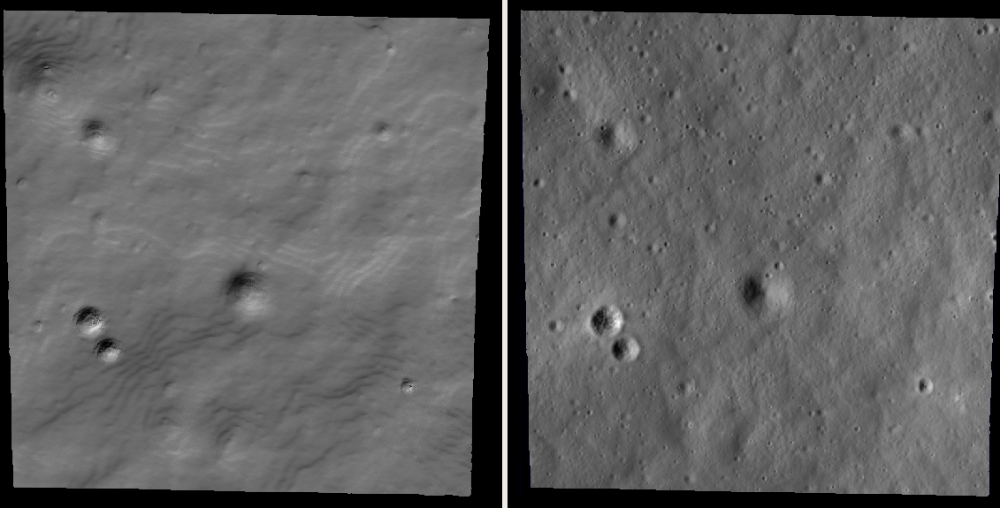

.. _tutorial:

How ASP works
=============

The Stereo Pipeline package contains command-line and GUI programs
that convert a stereo pair consisting of images and cameras into a
3D "point cloud" image. This is an intermediate format that can be
passed along to one of several programs that convert a point cloud
into a mesh for 3D viewing, a gridded digital terrain model (DTM) for
GIS purposes, or a LAS/LAZ point cloud.

There are a number of ways to fine-tune parameters and analyze the results, but
ultimately this software suite takes images and builds models in a mostly
automatic way. 

To create a point cloud file, *not necessarily of best quality*, for now, 
one simply passes two image files to
the ``parallel_stereo`` (:numref:`parallel_stereo`) command::

    parallel_stereo --stereo-algorithm asp_bm \
      left_image.cub right_image.cub results/run

Higher quality results, at the expense of more computation, can be
achieved by running::

    parallel_stereo --alignment-method affineepipolar \
      --stereo-algorithm asp_mgm --subpixel-mode 3    \
      left_image.cub right_image.cub results/run

The option ``--subpixel-mode 9`` is faster and still creates decent
results (with ``asp_mgm``/``asp_sgm``). The best quality will likely
be obtained with ``--subpixel-mode 2``, but this is even more
computationally expensive. 

It is very recommended to read :numref:`nextsteps`, which describes
other alignment methods and stereo algorithms.

Then normally one would create a DEM (:numref:`point2dem`)::
  
      point2dem --stereographic --auto-proj-center results/run-PC.tif
      
Here it is assumed that the ``PATH`` and ``ISISDATA`` environmental
variables have been set, as shown in :numref:`installation`. 

The ``.cub`` file format is used for non-Earth images
(:numref:`moc_tutorial`). For Earth, the images are usually in the
``.tif`` format (:numref:`dg_tutorial`).

The above commands will decompose the images in tiles to run in parallel,
potentially on multiple machines (:numref:`parallel_stereo`).

Or the ``stereo_gui`` frontend can be invoked, with the same options,
as described in :numref:`stereo_gui`.  This tool makes it possible to
manually select smaller clips on which to run ``parallel_stereo``.

The string ``results/run`` is an arbitrary output prefix. All
``parallel_stereo`` output files will be in the ``results`` directory
and start with ``output``. See :numref:`outputfiles` for the list of
output files.

A a visualizable mesh can be made with the following
command (the ``results/run-PC.tif`` and ``results/run-L.tif`` files
are created by the ``parallel_stereo`` program above)::

     point2mesh results/run-PC.tif results/run-L.tif

Visualization is further discussed in :numref:`visualising`.

A produced DEM may need to be aligned to some pre-existing reference
(:numref:`pc_align`). 

If the positions, orientations, or intrinsics of the cameras are not known well,
then bundle adjustment may be necessary (:numref:`bundle_adjustment`).

What follows are two examples of processing non-Earth data. An example
using Earth data is in :numref:`dg_tutorial`. The various stereo
algorithms are discussed in :numref:`nextsteps`. More examples can be
found in :numref:`examples`.

.. _nonearth_tutorial:

Tutorial: Processing planetary data (non-Earth)
===============================================

.. _lronac_csm:

Lightning-fast example using Lunar images
-----------------------------------------

This example is designed to have the user create useful results with
ASP using Lunar data 10 minutes or less. It does not require a
download of ISIS or ISIS data (which can be a couple of hundreds of
GB) because it uses the CSM camera model (:numref:`csm`). The steps
to process it are as follows:

 - Get ASP per the installation page (:numref:`installation`).
 
 - Fetch the `LRO NAC example <https://github.com/NeoGeographyToolkit/StereoPipelineSolvedExamples/releases/download/LRONAC/LRONAC_example.tar>`_ with ``wget``, and extract it as::
  
    tar xfv LRONAC_example.tar

- Start ``stereo_gui`` (:numref:`stereo_gui`) with a selection of
  clips::

    cd LRONAC_example
    stereo_gui M181058717LE_crop.cub M181073012LE_crop.cub \
      M181058717LE.json M181073012LE.json                  \
      --alignment-method local_epipolar                    \
      --left-image-crop-win 2259 1196 900 973              \
      --right-image-crop-win 2432 1423 1173 1218           \
      --stereo-algorithm asp_mgm --subpixel-mode 9         \
      run/run

The crop windows from above will show up as red rectangles.

Choose from the menu ``Run -> Run parallel_stereo``. When finished,
quit the GUI and run from the command line::

    point2dem --stereographic --auto-proj-center \
      --errorimage run/run-PC.tif --orthoimage run/run-L.tif

Open the computed DEM and orthoimage as::

   stereo_gui run/run-DEM.tif run/run-DRG.tif

Right-click on the DEM on the left and choose to toggle hillshading to
show the DEM hillshaded. See the figure below for the output.
   
How to get higher quality results is described in  :numref:`nextsteps`. 

For other examples, see :numref:`examples`. 
 

   Example of produced DEM and orthoimage using LRO NAC stereo pair
   ``M181058717LE`` and ``M181073012LE`` and CSM cameras. How to obtain and
   prepare the inputs is discussed in :numref:`lronac-example`. Mapprojection
   can eliminate the staircasing artifacts (:numref:`mapproj-example`).

.. _moc_tutorial:

Example using Mars MOC images
-----------------------------

The data set that is used in the tutorial and examples below is a pair
of Mars Orbital Camera (MOC)
:cite:`1992JGR.97.7699M,2001JGR.10623429M` images
whose PDS Product IDs are M01/00115 and E02/01461. This data can be
downloaded from the PDS directly, or they can be found in the
``examples/MOC`` directory of your Stereo Pipeline distribution.

These raw PDS images (``M0100115.imq`` and ``E0201461.imq``) need to
be converted to .cub files and radiometrically calibrated. You will
need to be in an ISIS environment (:numref:`planetary_images`),
usually via a ``conda activate`` command which sets the ``ISISROOT``
and ``ISISDATA`` environment variables; we will denote this state with
the ``ISIS>`` prompt.

Then you can use 
the ``mocproc`` program, as follows::

     ISIS> mocproc from=M0100115.imq to=M0100115.cub Mapping=NO
     ISIS> mocproc from=E0201461.imq to=E0201461.cub Mapping=NO

There are also ``Ingestion`` and ``Calibration`` parameters whose
defaults are ``YES`` which will bring the image into the ISIS format
and perform radiometric calibration. By setting the ``Mapping``
parameter to ``NO``, the resultant file will be an ISIS cube file
that is calibrated, but not map-projected. Note that while we have
not explicitly run ``spiceinit``, the Ingestion portion of ``mocproc``
quietly ran ``spiceinit`` for you (you'll find the record of it in
the ISIS Session Log, usually written out to a file named ``print.prt``).
:numref:`p19-images` shows the results at this stage of processing.

.. _p19-images:

.. figure:: images/p19-figure.png
   :alt: MOC images after initial processing.

   This figure shows ``E0201461.cub`` and
   ``M0100115.cub`` open in ISIS's qview program. The view on the left
   shows their full extents at the same zoom level, showing how they have
   different ground scales. The view on the right shows both images zoomed
   in on the same feature.

See :numref:`examples` for many solved examples, including how to preprocess the
data with tools specific for each mission.

Once the ``.cub`` files are obtained, it is possible to run
``parallel_stereo`` right away, and create a DEM::

     ISIS> parallel_stereo E0201461.cub M0100115.cub    \
             --alignment-method affineepipolar          \
             -s stereo.default.example results/output
     ISIS> point2dem --stereographic --auto-proj-center \
             results/output-PC.tif

In this case, the first thing ``parallel_stereo`` does is to
internally align (or rectify) the images, which helps with finding
stereo matches. Here we have used ``affineepipolar`` alignment. Other
alignment methods are described in :numref:`settingoptionsinstereodefault`.

If your data has steep slopes, mapprojection can improve the results.
See :numref:`mapproj-example` and :numref:`mapproj_with_cam2map`. 

When creating a DEM, it is suggested to use a local projection
(:numref:`point2dem`), especially towards poles.

See :numref:`nextsteps` for a more in-depth discussion of stereo
algorithms.

.. figure:: images/p19-colorized-shaded_500px.png

   The produced colorized DEM, the shaded relief image, and the
   colorized hillshade. See :numref:`builddem` for more details.

.. _dg_tutorial:

Tutorial: Processing Earth images
=================================

In this chapter we will focus on how to process Earth images, or more
specifically DigitalGlobe (Maxar) WorldView and QuickBird images. This example is
different from the one in the previous chapter in that at no point will we be
using ISIS utilities. This is because ISIS only supports NASA instruments, while
most Earth images comes from commercial providers.

In addition to DigitalGlobe/Maxar's satellites, ASP supports any Earth
images that uses the RPC camera model format. How to process such data
is described in :numref:`rpc`, although following this tutorial may
still be insightful even if your data is not from DigitalGlobe/Maxar.

If this is your first time running ASP, it may be easier to start with
ASTER data (:numref:`aster`), as its images are free and much smaller
than DigitalGlobe's. A ready-made example having all inputs, outputs,
and commands, is provided there.

DigitalGlobe provides images from QuickBird and the three WorldView satellites.
These are the hardest images to process with Ames Stereo Pipeline because they
are exceedingly large, much larger than HiRISE images. The GUI
(:numref:`stereo_gui`) can be used to run stereo on just a portion of the
images.

The camera information for DigitalGlobe/Maxar images is contained in an XML
file for each image. In addition to the exact linear camera model, the
XML file also has its RPC approximation. In this chapter we will focus
only on processing data using the linear camera model. For more detail
on RPC camera models we refer as before to :numref:`rpc`.

Our implementation of the Digital Globe linear camera model accounts
for the sensor geometry, velocity aberration and atmospheric
refraction (:numref:`dg_csm`).

In the next two sections we will show how to process unmodified and
map-projected variants of WorldView images. The images we are using
is from the free stereo pair labeled "System-Ready (1B) Stereo, 50cm"
which captures the city of Stockholm, found on DigitalGlobe/Maxar's website 
(https://www.digitalglobe.com/samples). These images represent a
non-ideal problem for us since this is an urban location, but at least
you should be able to download these images yourself and follow along.

Supported products
------------------

ASP can only process Level 1B satellite images, and cannot process
DigitalGlobe's aerial images or orthorectified images (see the `product info 
<https://securewatchdocs.maxar.com/en-us/Orders/Orders_ProductInfo.htm>`_).

.. _rawdg:

Processing raw
--------------

After you have downloaded the example stereo images of Stockholm, you
will find a directory titled::

    056082198020_01_P001_PAN

It has a lot of files and many of them contain redundant information
just displayed in different formats. We are interested only in the TIF
or NTF images and the similarly named XML files.

Some WorldView folders will contain multiple image files. This is because
DigitalGlobe/Maxar breaks down a single observation into multiple files for what
we assume are size reasons. These files have a pattern string of "_R[N]C1-",
where N increments for every subframe of the full observation. The tool named
``dg_mosaic`` (:numref:`dg_mosaic`) can be used to mosaic such a set of
sub-observations into a single image file and create an appropriate camera
file::

    dg_mosaic 12FEB16101327*TIF --output-prefix 12FEB16101327

and analogously for the second set. See :numref:`dg_mosaic` for more
details. The ``parallel_stereo`` program can use either the original or the
mosaicked images. This sample data only contains two image files
so we do not need to use ``dg_mosaic``.

Since we are ingesting these images raw, it is strongly recommended that
you use affine epipolar alignment to reduce the search range. Commands::

    parallel_stereo -t dg --stereo-algorithm asp_mgm      \
      --subpixel-mode 9 --alignment-method affineepipolar \
      12FEB16101327.r50.tif 12FEB16101426.r50.tif         \
      12FEB16101327.r50.xml 12FEB16101426.r50.xml         \
      run/run
    point2dem --stereographic --auto-proj-center run-PC.tif

As discussed in :numref:`tutorial`, one can experiment with various
tradeoffs of quality versus run time by using various stereo
algorithms, and use stereo in parallel or from a GUI. For more
details, see :numref:`nextsteps`.

How to create a DEM and visualize the results of stereo is described in
:numref:`visualising`.

.. figure:: images/examples/dg/wv_tutorial.png
   :name: fig:dg-example

   A colorized and hillshaded terrain model for Grand Mesa, Colorado, produced
   with WorldView images, while employing mapprojection
   (:numref:`mapproj-example`).

It is important to note that we could have performed stereo using the
approximate RPC model instead of the exact linear camera model (both
models are in the same XML file), by switching the session in the
``parallel_stereo`` command above from ``-t dg`` to ``-t rpc``. The
RPC model is somewhat less accurate, so the results will not be the
same, in our experiments we've seen differences in the 3D terrains
using the two approaches of 5 meters or more.

Many more stereo processing examples can be found in :numref:`examples`.

.. _mapproj:

Processing map-projected images
--------------------------------

ASP computes the highest quality 3D terrain if used with images
map-projected onto a low-resolution DEM that is used as an initial
guess. This process is described in :numref:`mapproj-example`.

.. _handling_clouds:

Dealing with clouds
-------------------

Clouds can result in unreasonably large disparity search ranges and a
long run-time. It is then suggested to mapproject the images
(:numref:`mapproj-example`).

With our without mapprojection, one can reduce the computed search
range via ``--max-disp-spread`` (:numref:`stereodefault`). 
Use this with care. Without mapprojection and with steep terrain,
the true spread of the disparity can, in rare cases, reach a few
thousand pixels. This is best used with mapprojected images,
when it is likely to be under 150-200, or even under 100.

If a reasonable DEM of the area of interest exists, the option
``--ip-filter-using-dem`` can be used to filter out interest points
whose heights differ by more than a given value than what is provided
by that DEM. This should reduce the search range. Without a DEM,
the option ``--elevation-limit`` can be used and should have a similar
effect.

Another option (which can be used in conjunction with the earlier
suggestions) is to tighten the outlier filtering in the low-resolution
disparity ``D_sub.tif`` (:numref:`outputfiles`), for example, by
setting ``--outlier-removal-params 70 2`` from the default ``95 3``
(:numref:`stereodefault`). Note that decreasing these a lot may also
filter out valid steep terrain.

If a run failed because of a large disparity search range,
``D_sub.tif`` should be deleted, parameters adjusted as above, and one
should run ``stereo_corr`` with the same arguments that
``parallel_stereo`` was run before (except those used for tiling and
number of processes, etc.), while adding the option
``--compute-low-res-disparity-only``. Then examine the re-created
``D_sub.tif`` with ``disparitydebug`` (:numref:`disparitydebug`) 
and the various search ranges printed on screen.

When ``D_sub.tif`` is found to be reasonable, ``parallel_stereo``
should be re-run with the option ``--resume-at-corr``.

See also :numref:`longrun` which offers further suggestions for
how to deal with long run-times.

.. _wvcorrect-example:

Handling CCD boundary artifacts
-------------------------------

DigitalGlobe/Maxar WorldView images :cite:`digital-globe:camera`
may exhibit slight subpixel artifacts which manifest themselves as
discontinuities in the 3D terrain obtained using ASP. We provide a tool
named ``wv_correct``, that can largely correct such artifacts for World
View-1 and WorldView-2 images for most TDI. 

Note that Maxar (DigitalGlobe) WorldView-2 images with a processing
date (not acquisition date) of May 26, 2022 or newer have much-reduced
CCD artifacts, and for those this tool will in fact make the solution
worse, not better. This does not apply to WorldView-1, 3, or GeoEye-1.

This tool can be invoked as follows::

    wv_correct image_in.ntf image.xml image_out.tif

The corrected images can be used just as the originals, and the camera
models do not change. When working with such images, we recommend that
CCD artifact correction happen first, on original un-projected images.
Afterward images can be mosaicked with ``dg_mosaic``, map-projected, and
the resulting data used to run stereo and create terrain models.

This tool is described in :numref:`wv_correct`, and an
example of using it is in :numref:`ccd-artifact-example`.

.. figure:: images/examples/ccd_before_after.png
   :name: ccd-artifact-example

   Example of a hill-shaded terrain obtained using stereo without (left)
   and with (right) CCD boundary artifact corrections applied using
   ``wv_correct``.

Jitter
------

Another source of artifacts in linescan cameras, such as from
DigitalGlobe, is jitter. ASP can solve for it using a jitter solver
(:numref:`jitter_solve`).

.. _sparse-disp:

Images lacking large-scale features
-----------------------------------

Stereo Pipeline's approach to performing correlation is a two-step
pyramid algorithm, in which low-resolution versions of the input images
are created, the disparity map (``output_prefix-D_sub.tif``) is found,
and then this disparity map is refined using increasingly
higher-resolution versions of the input images (:numref:`d-sub`).

This approach usually works quite well for rocky terrain but may fail
for snowy landscapes, whose only features may be small-scale grooves or
ridges sculpted by wind (so-called *zastrugi*) that disappear at low
resolution.

A first attempt at solving this is to run ``parallel_stereo`` with::

     --corr-seed-mode 0 --corr-max-levels 2

This will prevent creating a low-resolution disparity which may be
inaccurate in this case. (Note that interest points which are computed
before this are found at full resolution, so they should turn out
well.) Here, ASP will run correlation with two levels, so the lower
initial resolution is a factor of 4 coarser than the original, which
will hopefully prevent small features from being lost.

If that is not sufficient or perhaps not fast enough, Stereo Pipeline
provides a tool named ``sparse_disp`` to create the low-resolution
initial disparity ``output_prefix-D_sub.tif`` based on full-resolution
images, yet only at a sparse set of pixels for reasons, of speed.
This low-resolution disparity is then refined as earlier using a
pyramid approach, but again with fewer levels.

.. figure:: images/examples/sparse_disp.png
   :name: fig:sparse-disp-example
   :figwidth: 100%

   Example of a difficult terrain obtained without (left) and with (right)
   ``sparse_disp``. (In these DEMs there is very little elevation change,
   hence the flat appearance.)

This mode can be invoked by passing to ``parallel_stereo`` the option
``--corr-seed-mode 3``. Also, during pyramid correlation it is suggested
to use somewhat fewer levels than the default ``--corr-max-levels 5``,
to again not subsample the images too much and lose the features.

Here is an example:

::

    parallel_stereo -t dg --corr-seed-mode 3            \
      --corr-max-levels 2                               \
      left_mapped.tif right_mapped.tif                  \
      12FEB12053305-P1BS_R2C1-052783824050_01_P001.XML  \
      12FEB12053341-P1BS_R2C1-052783824050_01_P001.XML  \
      dg/dg srtm_53_07.tif

If ``sparse_disp`` is not working well for your images you may be able
to improve its results by experimenting with the set of ``sparse_disp``
options which can be passed into ``parallel_stereo`` through the
``--sparse-disp-options`` parameter. ``sparse_disp`` has so far only
been tested with ``affineepipolar`` image alignment so you may not get
good results with other alignment methods.

The ``sparse_disp`` tool is written in Python, and it depends on a
version of GDAL that is newer than what we support in ASP and on other
Python modules that we don't ship. It is suggested to to use the Conda
Python management system at

  https://docs.conda.io/en/latest/miniconda.html

to install these dependencies. This can be done as follows::

    conda create --name sparse_disp -c conda-forge python=3.12 gdal=3.8
    conda activate sparse_disp
    conda install -c conda-forge scipy

Assuming that you used the default installation path for ``conda``, which is
``$HOME/miniconda3``, before running the ``parallel_stereo`` command, as shown
above, one needs to set::

    export ASP_PYTHON_MODULES_PATH=$HOME/miniconda3/envs/sparse_disp/lib/python3.12/site-packages

It is very important that the same version of Python be used here as
the one shipped with ASP. Note that if GDAL is fetched from a
different repository than conda-forge, one may run into issues with
dependencies not being correct, and then it will fail at runtime.

Multi-spectral images
---------------------

In addition to panchromatic (grayscale) images, the DigitalGlobe/Maxar
satellites also produce lower-resolution multi-spectral (multi-band)
images. Stereo Pipeline is designed to process single-band images only.
If invoked on multi-spectral data, it will quietly process the first
band and ignore the rest. To use one of the other bands it can be
singled out by invoking ``dg_mosaic`` (:numref:`rawdg`) with
the ``--band <num>`` option. We have evaluated ASP with DigitalGlobe/Maxar's
multi-spectral images, but support for it is still experimental. We
recommend using the panchromatic images whenever possible.

.. _dg_csm:

Implementation details
----------------------

WorldView linescan cameras use the CSM model (:numref:`csm`) internally. The
session name must still be ``-t dg``, ``-t dgmaprpc``, etc., rather than ``-t
csm``, ``-t csmmapcsm``, etc.

Bundle adjustment (:numref:`bundle_adjust`) and solving for jitter
(:numref:`jitter_solve`) produce optimized camera models in CSM's model state
format (:numref:`csm_state`). These can be used just as the original
cameras, but with the option ``-t csm``. Alternatively, the ``bundle_adjust``
.adjust files can be used with the original cameras. 

Atmospheric refraction and velocity aberration (:cite:`nugent1966velocity`) are
corrected for. These make the linescan models be very close to the associated
RPC models. These corrections are incorporated by slightly modifying the
linescan rotation samples as part of the CSM model upon loading. 

Bundle adjustment (:numref:`bundle_adjust`) and alignment (:numref:`pc_align`)
are still recommended even given these corrections.

WorldView images and cameras can be combined with those from other linescan
instruments, such as Pleiades (:numref:`pleiades`), and also with frame camera
models (:numref:`pinholemodels`), for the purposes of refining the cameras and
creating terrain models (:numref:`ba_frame_linescan`).
